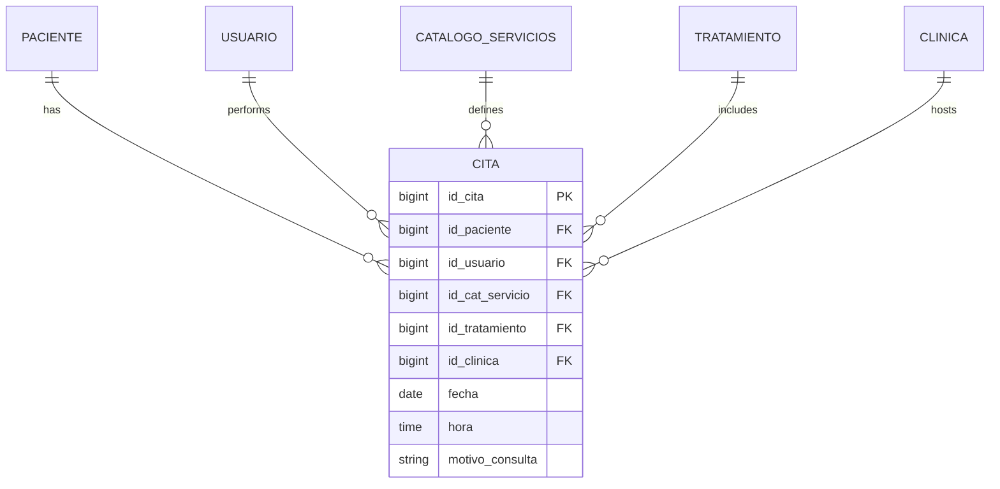
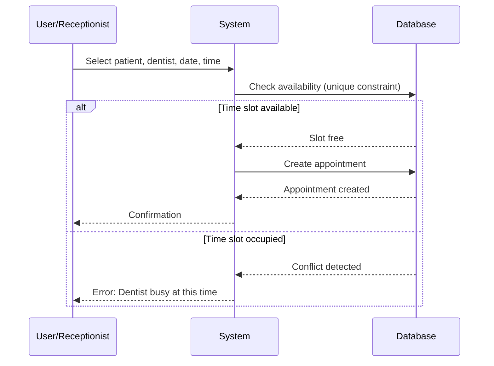

## Overview

The appointment (Cita) system manages scheduling between patients, dentists, and services. It prevents double-booking through unique constraints and tracks appointment details including date, time, and consultation reasons.

<CardGroup cols={2}>
  <Card title="Conflict Prevention" icon="shield-check">
    Unique constraint prevents double-booking dentists
  </Card>
  <Card title="Multi-Entity" icon="diagram-project">
    Links patients, dentists, services, and treatments
  </Card>
  <Card title="Flexible Scheduling" icon="clock">
    Date and time tracking with consultation motives
  </Card>
  <Card title="Treatment Integration" icon="tooth">
    Optional linkage to ongoing treatments
  </Card>
</CardGroup>

## Data Model

The `Cita` model orchestrates the relationship between patients, healthcare providers, services, and treatments.

### Database Schema

See migration at `~/workspace/source/database/migrations/2026_03_01_231623_create_citas_table.php:14-54`

```php
Schema::create('citas', function (Blueprint $table) {
    $table->id('id_cita');
    
    $table->unsignedBigInteger('id_paciente');
    $table->unsignedBigInteger('id_usuario');
    $table->unsignedBigInteger('id_cat_servicio');
    $table->unsignedBigInteger('id_tratamiento')->nullable();
    $table->unsignedBigInteger('id_clinica');
    
    $table->date('fecha');
    $table->time('hora');
    $table->string('motivo_consulta')->nullable();
    
    $table->timestamps();
    
    // Foreign keys
    $table->foreign('id_paciente')
        ->references('id_paciente')
        ->on('paciente')
        ->onDelete('cascade');
    
    $table->foreign('id_usuario')
        ->references('id_usuario')
        ->on('usuario')
        ->onDelete('cascade');
    
    $table->foreign('id_tratamiento')
        ->references('id_tratamiento')
        ->on('tratamiento')
        ->onDelete('cascade');
    
    $table->foreign('id_cat_servicio')
        ->references('id_cat_servicio')
        ->on('catalogo_servicios')
        ->onDelete('cascade');
    
    $table->foreign('id_clinica')
        ->references('id_clinica')
        ->on('clinica')
        ->onDelete('cascade');
    
    // Prevent double-booking
    $table->unique(['id_usuario', 'fecha', 'hora']);
});
```

### Model Attributes

See complete model at `~/workspace/source/app/Models/Cita.php:17-25`

| Field | Type | Description |
|-------|------|-------------|
| `id_cita` | bigint | Primary key |
| `id_paciente` | bigint | Patient receiving care (required) |
| `id_usuario` | bigint | Dentist/practitioner (required) |
| `id_cat_servicio` | bigint | Service being provided (required) |
| `id_tratamiento` | bigint | Related treatment (optional) |
| `id_clinica` | bigint | Clinic where appointment occurs (required) |
| `fecha` | date | Appointment date |
| `hora` | time | Appointment time |
| `motivo_consulta` | string | Reason for visit/consultation motive |

## Relationships

The Cita model connects five different entities, creating a comprehensive scheduling context.

### Belongs to Patient

See `~/workspace/source/app/Models/Cita.php:30-33`

```php
public function paciente()
{
    return $this->belongsTo(Paciente::class, 'id_paciente', 'id_paciente');
}
```

### Belongs to Usuario (Dentist)

See `~/workspace/source/app/Models/Cita.php:35-39`

```php
public function usuario()
{
    return $this->belongsTo(Usuario::class, 'id_usuario', 'id_usuario');
}
```

<Note>
The `Usuario` represents the healthcare provider (dentist, orthodontist, etc.) performing the service.
</Note>

### Belongs to Treatment

See `~/workspace/source/app/Models/Cita.php:41-45`

```php
public function tratamiento()
{
    return $this->belongsTo(Tratamiento::class, 'id_tratamiento', 'id_tratamiento');
}
```

<Accordion title="When to Link Treatments">
  - **With Treatment**: Appointment is part of an ongoing treatment plan (e.g., 3rd session of root canal)
  - **Without Treatment**: Standalone appointment (e.g., routine cleaning, consultation)
  
  The `id_tratamiento` field is nullable to support both scenarios.
</Accordion>

### Belongs to Service

See `~/workspace/source/app/Models/Cita.php:47-51`

```php
public function servicio()
{
    return $this->belongsTo(CatalogoServicios::class, 'id_cat_servicio', 'id_cat_servicio');
}
```

The service catalog defines:
- Service name (e.g., "Limpieza Dental", "Extracción")
- Duration in minutes
- Suggested price
- Service description

## Entity Relationship Diagram



## Conflict Prevention

The appointment system prevents double-booking through a unique constraint.

### Unique Constraint

See migration at `~/workspace/source/database/migrations/2026_03_01_231623_create_citas_table.php:53`

```php
$table->unique(['id_usuario', 'fecha', 'hora']);
```

This constraint ensures:
- A dentist cannot have two appointments at the same date and time
- Prevents scheduling conflicts
- Database-level enforcement (cannot be bypassed)

<Warning>
Attempting to create an appointment that conflicts with an existing one will throw a database constraint violation. Handle this in your controller with try-catch:

```php
try {
    Cita::create($validatedData);
} catch (\Illuminate\Database\QueryException $e) {
    if ($e->getCode() === '23000') {
        return back()->withErrors([
            'hora' => 'El dentista ya tiene una cita a esta hora.'
        ]);
    }
    throw $e;
}
```
</Warning>

## Date and Time Handling

### Date Field

Stored as MySQL `date` type (YYYY-MM-DD format):

```php
// Creating an appointment
'fecha' => '2026-03-15', // March 15, 2026

// From user input
'fecha' => $request->fecha, // Ensure proper format validation
```

### Time Field

Stored as MySQL `time` type (HH:MM:SS format):

```php
// Creating an appointment
'hora' => '14:30:00', // 2:30 PM

// Laravel accepts HH:MM format too
'hora' => '14:30', // Automatically converts to 14:30:00
```

### Validation Example

```php
$validated = $request->validate([
    'fecha' => 'required|date|after_or_equal:today',
    'hora' => 'required|date_format:H:i',
    'id_paciente' => 'required|exists:paciente,id_paciente',
    'id_usuario' => 'required|exists:usuario,id_usuario',
    'id_cat_servicio' => 'required|exists:catalogo_servicios,id_cat_servicio',
    'id_tratamiento' => 'nullable|exists:tratamiento,id_tratamiento',
    'motivo_consulta' => 'nullable|string|max:255',
]);
```

## Creating an Appointment

Typical workflow for scheduling a new appointment:

### Basic Appointment

```php
$cita = Cita::create([
    'id_paciente' => 1,
    'id_usuario' => 2, // Dentist ID
    'id_cat_servicio' => 5, // e.g., "Cleaning"
    'id_clinica' => auth()->user()->id_clinica,
    'fecha' => '2026-03-20',
    'hora' => '10:00',
    'motivo_consulta' => 'Routine 6-month cleaning'
]);
```

### Appointment Linked to Treatment

```php
$cita = Cita::create([
    'id_paciente' => 1,
    'id_usuario' => 2,
    'id_cat_servicio' => 8, // e.g., "Root Canal Session"
    'id_tratamiento' => 15, // Existing treatment plan
    'id_clinica' => auth()->user()->id_clinica,
    'fecha' => '2026-03-22',
    'hora' => '15:30',
    'motivo_consulta' => 'Root canal - 2nd session'
]);
```

## Querying Appointments

### Today's Appointments for a Dentist

```php
$citasHoy = Cita::where('id_usuario', $dentistaId)
    ->whereDate('fecha', today())
    ->orderBy('hora')
    ->with(['paciente', 'servicio'])
    ->get();
```

### Patient's Upcoming Appointments

```php
$proximasCitas = Cita::where('id_paciente', $pacienteId)
    ->where('fecha', '>=', today())
    ->orderBy('fecha')
    ->orderBy('hora')
    ->with(['usuario', 'servicio'])
    ->get();
```

### Clinic's Schedule for a Date Range

```php
$citasSemana = Cita::where('id_clinica', $clinicaId)
    ->whereBetween('fecha', [$fechaInicio, $fechaFin])
    ->orderBy('fecha')
    ->orderBy('hora')
    ->with(['paciente', 'usuario', 'servicio'])
    ->get();
```

### Available Time Slots

To find available slots, query existing appointments and find gaps:

```php
// Get all appointments for a dentist on a specific date
$citasExistentes = Cita::where('id_usuario', $dentistaId)
    ->whereDate('fecha', $fecha)
    ->pluck('hora')
    ->toArray();

// Define working hours
$horasDisponibles = [
    '09:00', '09:30', '10:00', '10:30', '11:00', '11:30',
    '14:00', '14:30', '15:00', '15:30', '16:00', '16:30', '17:00'
];

// Filter out occupied slots
$slotsLibres = array_diff($horasDisponibles, $citasExistentes);
```

## Service Catalog Integration

Appointments must reference a service from the clinic's catalog.

### CatalogoServicios Schema

See migration at `~/workspace/source/database/migrations/2026_02_23_085029_create_catalogo_servicios_table.php:14-34`

```php
Schema::create('catalogo_servicios', function (Blueprint $table) {
    $table->id('id_cat_servicio');
    
    $table->unsignedBigInteger('id_clinica');
    
    $table->string('nombre');
    $table->text('descripcion')->nullable();
    $table->integer('duracion')->nullable(); // in minutes
    $table->decimal('precio_sugerido', 10, 2)->nullable();
    $table->enum('estatus', ['activo', 'baja'])->default('activo');
    
    $table->timestamps();
    
    $table->foreign('id_clinica')
          ->references('id_clinica')
          ->on('clinica')
          ->onDelete('cascade');
    
    $table->unique(['id_clinica', 'nombre']);
});
```

### Using Service Duration

```php
// Fetch appointment with service duration
$cita = Cita::with('servicio')->find($id);

$horaInicio = $cita->hora; // e.g., "10:00:00"
$duracion = $cita->servicio->duracion; // e.g., 60 minutes

// Calculate end time
$horaFin = \Carbon\Carbon::parse($horaInicio)
    ->addMinutes($duracion)
    ->format('H:i:s'); // e.g., "11:00:00"
```

<Note>
Service duration can be used to calculate appointment end times and prevent overlapping appointments more intelligently.
</Note>

## Cascade Deletion Behavior

Appointments are automatically deleted when related entities are removed:

| Deleted Entity | Effect on Appointments |
|----------------|------------------------|
| Patient | All patient's appointments deleted |
| Usuario (Dentist) | All dentist's appointments deleted |
| Clinic | All clinic's appointments deleted |
| Treatment | Appointments linked to treatment are deleted |
| Service | Appointments using that service are deleted |

<Warning>
Cascade deletion is destructive. Consider implementing soft deletes or archiving for historical record keeping:

```php
// In migration, change behavior
$table->foreign('id_tratamiento')
    ->references('id_tratamiento')
    ->on('tratamiento')
    ->onDelete('set null'); // Instead of cascade
```
</Warning>

## Best Practices

<AccordionGroup>
  <Accordion title="Always Check for Conflicts">
    Before creating appointments, verify the time slot is available:
    
    ```php
    $exists = Cita::where('id_usuario', $dentistaId)
        ->where('fecha', $fecha)
        ->where('hora', $hora)
        ->exists();
    
    if ($exists) {
        return back()->withErrors(['hora' => 'Horario no disponible']);
    }
    ```
  </Accordion>
  
  <Accordion title="Use Carbon for Date/Time">
    Laravel's Carbon library makes date manipulation easier:
    
    ```php
    use Carbon\Carbon;
    
    $cita->fecha = Carbon::parse($request->fecha);
    $cita->hora = Carbon::createFromFormat('H:i', $request->hora);
    ```
  </Accordion>
  
  <Accordion title="Eager Load Relationships">
    Prevent N+1 queries when displaying appointment lists:
    
    ```php
    $citas = Cita::with(['paciente', 'usuario', 'servicio', 'tratamiento'])
        ->get();
    ```
  </Accordion>
  
  <Accordion title="Validate Business Hours">
    Ensure appointments are scheduled during clinic operating hours:
    
    ```php
    $request->validate([
        'hora' => [
            'required',
            'date_format:H:i',
            function ($attribute, $value, $fail) {
                $hora = Carbon::createFromFormat('H:i', $value);
                if ($hora->hour < 9 || $hora->hour >= 18) {
                    $fail('La hora debe estar entre 09:00 y 18:00.');
                }
            },
        ],
    ]);
    ```
  </Accordion>
  
  <Accordion title="Consider Service Duration">
    When scheduling, account for service duration to prevent overlaps:
    
    ```php
    $servicio = CatalogoServicios::find($request->id_cat_servicio);
    $horaFin = Carbon::parse($request->hora)
        ->addMinutes($servicio->duracion);
    
    // Check if any appointment overlaps this time window
    $overlap = Cita::where('id_usuario', $request->id_usuario)
        ->where('fecha', $request->fecha)
        ->where(function($q) use ($request, $horaFin) {
            $q->whereBetween('hora', [$request->hora, $horaFin])
              ->orWhereRaw('ADDTIME(hora, SEC_TO_TIME(duracion*60)) > ?', [$request->hora]);
        })
        ->exists();
    ```
  </Accordion>
</AccordionGroup>

## Appointment Workflow



## Related Features

<CardGroup cols={3}>
  <Card title="Patient Management" icon="user" href="/features/patient-management">
    View patient details for appointments
  </Card>
  <Card title="Treatments" icon="tooth" href="/features/treatments">
    Link appointments to treatment plans
  </Card>
  <Card title="Clinical Records" icon="file-medical" href="/features/clinical-records">
    Document appointment outcomes in evolution notes
  </Card>
</CardGroup>