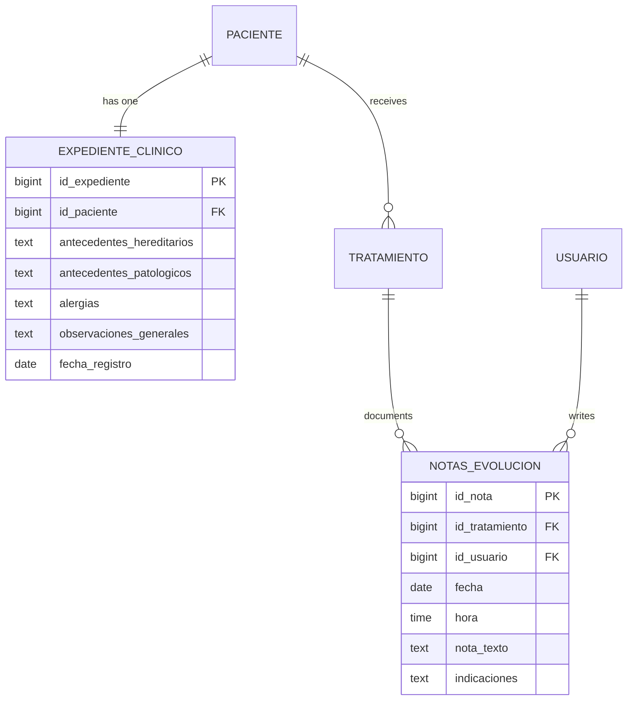

## Overview

The clinical records system maintains detailed medical histories and treatment documentation for each patient. It consists of two main components: clinical files (Expediente Clínico) with baseline medical history, and evolution notes (Notas de Evolución) that document treatment progress.

<CardGroup cols={2}>
  <Card title="Medical History" icon="clipboard-medical">
    Comprehensive baseline health records for each patient
  </Card>
  <Card title="Evolution Notes" icon="notes-medical">
    Session-by-session treatment documentation
  </Card>
  <Card title="One-to-One Files" icon="user-doctor">
    Each patient has exactly one clinical file
  </Card>
  <Card title="Treatment Linked" icon="link">
    Evolution notes tied to specific treatments
  </Card>
</CardGroup>

## Clinical Files (Expediente Clínico)

The clinical file stores the patient's baseline medical information that remains relatively stable over time.

### Data Model

See model at `~/workspace/source/app/Models/ExpedienteClinico.php`

### Database Schema

See migration at `~/workspace/source/database/migrations/2026_02_23_092325_create_expediente_clinico_table.php:14-34`

```php
Schema::create('expediente_clinico', function (Blueprint $table) {
    $table->id('id_expediente');
    
    // One-to-one relationship with patient
    $table->unsignedBigInteger('id_paciente')->unique();
    
    // Medical history fields
    $table->text('antecedentes_hereditarios')->nullable();
    $table->text('antecedentes_patologicos')->nullable();
    $table->text('alergias')->nullable();
    $table->text('observaciones_generales')->nullable();
    
    $table->date('fecha_registro')->nullable();
    
    $table->timestamps();
    
    // Foreign key with cascade delete
    $table->foreign('id_paciente')
          ->references('id_paciente')
          ->on('paciente')
          ->onDelete('cascade');
});
```

### Model Attributes

See fillable fields at `~/workspace/source/app/Models/ExpedienteClinico.php:17-24`

| Field | Type | Description |
|-------|------|-------------|
| `id_expediente` | bigint | Primary key |
| `id_paciente` | bigint | Foreign key to patient (unique) |
| `antecedentes_hereditarios` | text | Hereditary medical conditions |
| `antecedentes_patologicos` | text | Personal pathological history |
| `alergias` | text | Known allergies |
| `observaciones_generales` | text | General observations |
| `fecha_registro` | date | Date of file creation |

<Note>
The `id_paciente` field has a unique constraint, ensuring each patient has exactly one clinical file.
</Note>

## Medical History Components

### Hereditary History (Antecedentes Hereditarios)

Records family medical history relevant to dental care:

<CardGroup cols={2}>
  <Card title="Diabetes" icon="syringe">
    Family history of diabetes (affects healing, periodontal disease)
  </Card>
  <Card title="Hypertension" icon="heart-pulse">
    High blood pressure (anesthesia considerations)
  </Card>
  <Card title="Hemophilia" icon="droplet">
    Bleeding disorders (extraction risks)
  </Card>
  <Card title="Cancer" icon="ribbon">
    Family cancer history (oral cancer screening)
  </Card>
</CardGroup>

Example:
```text
"Padre diabético tipo 2. Madre con hipertensión controlada. 
Abuela materna con osteoporosis."
```

### Pathological History (Antecedentes Patológicos)

Patient's personal medical conditions:

<Accordion title="Systemic Diseases">
  - Diabetes mellitus
  - Hypertension
  - Heart disease
  - Kidney disease
  - Liver conditions
  - Autoimmune disorders
</Accordion>

<Accordion title="Medications">
  Current medications that may affect dental treatment:
  - Anticoagulants (bleeding risk)
  - Bisphosphonates (osteonecrosis risk)
  - Immunosuppressants (infection risk)
  - Corticosteroids (healing impairment)
</Accordion>

<Accordion title="Previous Surgeries">
  Relevant surgical history:
  - Previous dental surgeries
  - Heart valve replacements (antibiotic prophylaxis)
  - Joint replacements (infection concerns)
</Accordion>

Example:
```text
"Hipertensión arterial diagnosticada 2020, controlada con Losartán 50mg/día.
No cirugías previas. Niega hospitalización reciente."
```

### Allergies (Alergias)

Critical for treatment safety:

<Warning>
Allergy information is life-critical. Document:
- Specific allergen
- Type of reaction
- Severity
- Date of last reaction
</Warning>

<CardGroup cols={3}>
  <Card title="Medications" icon="pills">
    Penicillin, NSAIDs, local anesthetics
  </Card>
  <Card title="Materials" icon="flask">
    Latex, metals (nickel, mercury)
  </Card>
  <Card title="Other" icon="triangle-exclamation">
    Food allergies, environmental allergies
  </Card>
</CardGroup>

Example:
```text
"Alergia a penicilina (rash cutáneo, 2018).
No alergias a anestésicos locales.
Alergia ambiental a polen (controlada)."
```

### General Observations (Observaciones Generales)

Additional relevant information:

- Smoking/alcohol habits
- Dental anxiety or phobias
- Special needs or accommodations
- Language barriers
- Pregnancy status
- Breastfeeding status

Example:
```text
"Fumador: 10 cigarrillos/día x 15 años.
Alta ansiedad dental, requiere manejo conductual.
Preferencia por citas matutinas."
```

## Relationship with Patient

See relationship at `~/workspace/source/app/Models/ExpedienteClinico.php:27-31`

```php
// ExpedienteClinico belongs to one patient
public function paciente()
{
    return $this->belongsTo(Paciente::class, 'id_paciente', 'id_paciente');
}
```

From the Patient side:
```php
// Patient has one clinical file
public function expediente()
{
    return $this->hasOne(ExpedienteClinico::class, 'id_paciente', 'id_paciente');
}
```

## Creating a Clinical File

Clinical files are typically created when a patient first registers:

```php
public function store(Request $request)
{
    $validated = $request->validate([
        'id_paciente' => 'required|exists:paciente,id_paciente|unique:expediente_clinico,id_paciente',
        'antecedentes_hereditarios' => 'nullable|string',
        'antecedentes_patologicos' => 'nullable|string',
        'alergias' => 'nullable|string',
        'observaciones_generales' => 'nullable|string',
    ]);
    
    $expediente = ExpedienteClinico::create([
        'id_paciente' => $validated['id_paciente'],
        'antecedentes_hereditarios' => $validated['antecedentes_hereditarios'],
        'antecedentes_patologicos' => $validated['antecedentes_patologicos'],
        'alergias' => $validated['alergias'],
        'observaciones_generales' => $validated['observaciones_generales'],
        'fecha_registro' => now()->toDateString()
    ]);
    
    return redirect()->route('pacientes.show', $validated['id_paciente'])
        ->with('success', 'Expediente clínico creado correctamente.');
}
```

### Combined Patient and File Creation

Often created together in a transaction:

```php
DB::transaction(function () use ($request) {
    // 1. Create patient
    $paciente = Paciente::create([
        'nombre' => $request->nombre,
        'apellido_paterno' => $request->apellido_paterno,
        // ... other patient fields
    ]);
    
    // 2. Create clinical file
    ExpedienteClinico::create([
        'id_paciente' => $paciente->id_paciente,
        'antecedentes_hereditarios' => $request->antecedentes_hereditarios,
        'antecedentes_patologicos' => $request->antecedentes_patologicos,
        'alergias' => $request->alergias,
        'observaciones_generales' => $request->observaciones_generales,
        'fecha_registro' => now()->toDateString()
    ]);
});
```

## Updating Clinical Files

Medical history should be updated when new information becomes available:

```php
public function update(Request $request, $id)
{
    $expediente = ExpedienteClinico::findOrFail($id);
    
    $validated = $request->validate([
        'antecedentes_hereditarios' => 'nullable|string',
        'antecedentes_patologicos' => 'nullable|string',
        'alergias' => 'nullable|string',
        'observaciones_generales' => 'nullable|string',
    ]);
    
    $expediente->update($validated);
    
    return redirect()->back()
        ->with('success', 'Expediente actualizado correctamente.');
}
```

<Note>
Consider implementing version history or audit logs for clinical file changes to maintain a complete record of modifications.
</Note>

## Evolution Notes (Notas de Evolución)

Evolution notes document treatment progress session by session.

### Data Model

See model at `~/workspace/source/app/Models/NotasEvolucion.php`

### Database Schema

See migration at `~/workspace/source/database/migrations/2026_02_23_093121_create_notas_evolucion_table.php`

```php
Schema::create('notas_evolucion', function (Blueprint $table) {
    $table->id('id_nota');
    
    $table->unsignedBigInteger('id_tratamiento');
    $table->unsignedBigInteger('id_usuario');
    
    $table->date('fecha');
    $table->time('hora');
    $table->text('nota_texto');
    $table->text('indicaciones')->nullable();
    
    $table->timestamps();
    
    // Foreign keys
    $table->foreign('id_tratamiento')
          ->references('id_tratamiento')->on('tratamiento')
          ->onDelete('cascade');
    
    $table->foreign('id_usuario')
          ->references('id_usuario')->on('usuario')
          ->onDelete('cascade');
});
```

### Model Attributes

See fillable fields at `~/workspace/source/app/Models/NotasEvolucion.php:17-24`

| Field | Type | Description |
|-------|------|-------------|
| `id_nota` | bigint | Primary key |
| `id_tratamiento` | bigint | Treatment being documented (required) |
| `id_usuario` | bigint | Dentist writing the note (required) |
| `fecha` | date | Note date |
| `hora` | time | Note time |
| `nota_texto` | text | Clinical note content (required) |
| `indicaciones` | text | Post-treatment instructions |

## Evolution Note Components

### Clinical Note (nota_texto)

Documents what was done during the session:

<Accordion title="SOAP Format (Recommended)">
  **S** - Subjective: Patient's complaints/symptoms
  
  **O** - Objective: Clinical findings
  
  **A** - Assessment: Diagnosis/evaluation
  
  **P** - Plan: Treatment performed and next steps
</Accordion>

Example:
```text
S: Paciente refiere dolor moderado en molar inferior derecho.
O: Caries profunda en pieza #46, sensible a percusión. 
   Radiografía muestra compromiso pulpar.
A: Pulpitis irreversible en #46.
P: Endodoncia iniciada. Apertura cameral, conductometría realizada.
   Medicación intraconducto (hidróxido de calcio).
   Obturación temporal.
```

### Instructions (indicaciones)

Post-treatment patient instructions:

<CardGroup cols={2}>
  <Card title="Medications" icon="prescription">
    Analgesics, antibiotics, anti-inflammatories
  </Card>
  <Card title="Care Instructions" icon="hand-holding-medical">
    Oral hygiene, dietary restrictions, activity limits
  </Card>
  <Card title="Warning Signs" icon="triangle-exclamation">
    When to call/return to clinic
  </Card>
  <Card title="Follow-up" icon="calendar-check">
    Next appointment scheduling
  </Card>
</CardGroup>

Example:
```text
- Tomar ibuprofeno 400mg cada 8 horas por 3 días
- Evitar masticar del lado tratado
- Mantener buena higiene oral
- Cita de seguimiento en 7 días para obturación definitiva
- Llamar si presenta inflamación excesiva o fiebre
```

## Relationships

### Belongs to Treatment

See relationship at `~/workspace/source/app/Models/NotasEvolucion.php:27-31`

```php
public function tratamiento()
{
    return $this->belongsTo(Tratamiento::class, 'id_tratamiento', 'id_tratamiento');
}
```

### Belongs to Usuario (Dentist)

See relationship at `~/workspace/source/app/Models/NotasEvolucion.php:33-37`

```php
public function usuario()
{
    return $this->belongsTo(Usuario::class, 'id_usuario', 'id_usuario');
}
```

## Creating Evolution Notes

Notes are created after each treatment session:

```php
public function store(Request $request)
{
    $validated = $request->validate([
        'id_tratamiento' => 'required|exists:tratamiento,id_tratamiento',
        'nota_texto' => 'required|string',
        'indicaciones' => 'nullable|string',
    ]);
    
    $nota = NotasEvolucion::create([
        'id_tratamiento' => $validated['id_tratamiento'],
        'id_usuario' => auth()->user()->id_usuario,
        'fecha' => now()->toDateString(),
        'hora' => now()->toTimeString(),
        'nota_texto' => $validated['nota_texto'],
        'indicaciones' => $validated['indicaciones']
    ]);
    
    return redirect()->route('tratamientos.show', $validated['id_tratamiento'])
        ->with('success', 'Nota de evolución registrada.');
}
```

## Viewing Treatment History

Display all notes for a treatment chronologically:

```php
// Controller
$tratamiento = Tratamiento::with([
    'notasEvolucion' => function($query) {
        $query->orderBy('fecha', 'desc')
              ->orderBy('hora', 'desc');
    },
    'notasEvolucion.usuario',
    'paciente',
    'catalogoTratamiento'
])->findOrFail($id);

return view('tratamientos.show', compact('tratamiento'));
```

```blade
{{-- View --}}
<h2>Historial de Notas de Evolución</h2>

@foreach($tratamiento->notasEvolucion as $nota)
<div class="nota-evolucion">
    <div class="nota-header">
        <strong>{{ $nota->fecha }} {{ substr($nota->hora, 0, 5) }}</strong>
        <span>Dr. {{ $nota->usuario->nombre }}</span>
    </div>
    
    <div class="nota-contenido">
        <h4>Nota Clínica:</h4>
        <p>{{ $nota->nota_texto }}</p>
        
        @if($nota->indicaciones)
        <h4>Indicaciones:</h4>
        <p>{{ $nota->indicaciones }}</p>
        @endif
    </div>
</div>
@endforeach
```

## Complete Patient Medical Record View

Combine clinical file with treatment history:

```php
$paciente = Paciente::with([
    'expediente',
    'tratamiento' => function($q) {
        $q->with(['catalogoTratamiento', 'notasEvolucion.usuario'])
          ->orderBy('fecha_inicio', 'desc');
    }
])->findOrFail($id);
```

This provides:
1. Baseline medical history (expediente)
2. All treatments (current and historical)
3. Complete treatment evolution notes
4. Chronological medical timeline

## Entity Relationship Diagram



## Best Practices

<AccordionGroup>
  <Accordion title="Create Clinical File Early">
    Create the expediente during patient registration, even if some fields are empty. It's easier to update than to create later.
  </Accordion>
  
  <Accordion title="Update Allergies Immediately">
    Allergies are critical safety information. Update the clinical file immediately when discovered and display prominently in the UI.
  </Accordion>
  
  <Accordion title="Document Every Session">
    Create an evolution note after every treatment session, no matter how minor. This creates:
    - Legal protection
    - Continuity of care
    - Quality assurance
    - Patient communication record
  </Accordion>
  
  <Accordion title="Use Structured Note Format">
    Adopt SOAP or similar structured format for consistency:
    - Easier to read
    - More complete documentation
    - Better for legal purposes
    - Facilitates data extraction
  </Accordion>
  
  <Accordion title="Include Specific Details">
    In evolution notes, document:
    - Tooth numbers (using FDI notation: #11-#48)
    - Anesthesia used and dose
    - Materials used
    - Patient tolerance
    - Complications or deviations from plan
  </Accordion>
  
  <Accordion title="Always Provide Instructions">
    Patient instructions (`indicaciones`) should:
    - Be clear and specific
    - Include medication names and dosages
    - List warning signs
    - Specify follow-up timing
  </Accordion>
  
  <Accordion title="Timestamp Accuracy">
    Use actual session date/time, not creation time of the note if entered later:
    
    ```php
    // If documenting after the fact
    'fecha' => $request->fecha_sesion, // Not now()
    'hora' => $request->hora_sesion,   // Not now()
    ```
  </Accordion>
</AccordionGroup>

## Legal and Compliance Considerations

<Warning>
Clinical records are legal documents. Ensure:

1. **Retention**: Store indefinitely or per local regulations (often 5-10 years after last visit)
2. **Privacy**: Comply with health information privacy laws (HIPAA in US, LFPDPPP in Mexico)
3. **Integrity**: Never delete notes. Use soft deletes or amendments if corrections needed
4. **Access Control**: Limit who can view/edit clinical records
5. **Backup**: Regular automated backups of all clinical data
</Warning>

## Querying Clinical Records

### Patients with Specific Allergies

```php
$pacientesAlergicos = ExpedienteClinico::where('alergias', 'LIKE', '%penicilina%')
    ->with('paciente')
    ->get();
```

### Patients with Diabetes (Risk Assessment)

```php
$diabeticos = ExpedienteClinico::where(function($q) {
    $q->where('antecedentes_hereditarios', 'LIKE', '%diabetes%')
      ->orWhere('antecedentes_patologicos', 'LIKE', '%diabetes%');
})
->with('paciente')
->get();
```

### Recent Evolution Notes by Dentist

```php
$notasRecientes = NotasEvolucion::where('id_usuario', $dentistaId)
    ->whereBetween('fecha', [now()->subDays(30), now()])
    ->with(['tratamiento.paciente', 'tratamiento.catalogoTratamiento'])
    ->orderBy('fecha', 'desc')
    ->get();
```

### Complete Patient Timeline

```php
// Combine appointments and evolution notes for complete timeline
$paciente = Paciente::with([
    'expediente',
    'citas' => function($q) {
        $q->orderBy('fecha', 'desc');
    },
    'tratamiento.notasEvolucion'
])->find($id);

// Merge and sort by date for unified timeline
$timeline = collect()
    ->merge($paciente->citas)
    ->merge($paciente->tratamiento->flatMap->notasEvolucion)
    ->sortByDesc('fecha');
```

## Related Features

<CardGroup cols={3}>
  <Card title="Patient Management" icon="user" href="/features/patient-management">
    Manage patients who own clinical records
  </Card>
  <Card title="Treatments" icon="tooth" href="/features/treatments">
    Treatments documented in evolution notes
  </Card>
  <Card title="Appointments" icon="calendar" href="/features/appointments">
    Sessions that generate evolution notes
  </Card>
</CardGroup>