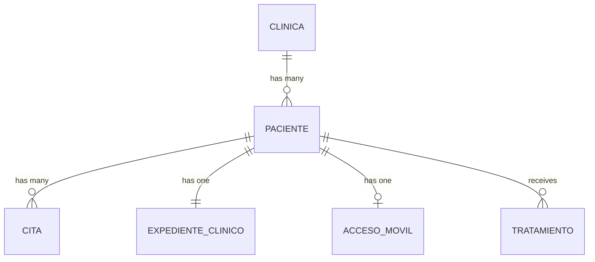
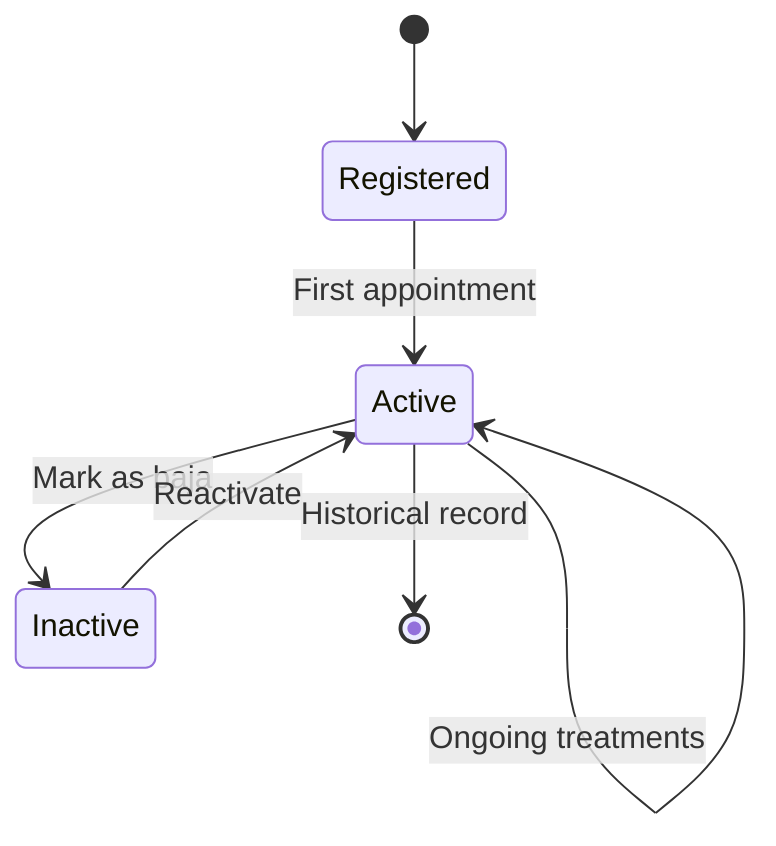

## Overview

The patient management system provides a complete profile for each patient, including personal demographics, contact information, medical history, and address details. Patients are scoped to specific clinics in the multi-tenant architecture.

<CardGroup cols={2}>
  <Card title="Complete Profiles" icon="id-card">
    Demographics, contact info, and medical data in one place
  </Card>
  <Card title="Clinic Scoped" icon="building">
    Each patient belongs to a specific clinic
  </Card>
  <Card title="Mobile Access" icon="mobile">
    Patients can access their records via mobile app
  </Card>
  <Card title="Clinical Records" icon="file-medical">
    Linked to comprehensive clinical files and evolution notes
  </Card>
</CardGroup>

## Data Model

The `Paciente` model stores comprehensive patient information with strong relationships to clinics and clinical records.

### Database Schema

See migration at `~/workspace/source/database/migrations/2026_02_23_090302_create_paciente_table.php:14-49`

```php
Schema::create('paciente', function (Blueprint $table) {
    $table->id('id_paciente');
    
    $table->unsignedBigInteger('id_clinica');
    
    // Personal information
    $table->string('nombre');
    $table->string('apellido_paterno');
    $table->string('apellido_materno')->nullable();
    
    $table->date('fecha_nacimiento')->nullable();
    $table->enum('sexo', ['hombre', 'mujer'])->nullable();
    
    $table->string('telefono')->nullable();
    $table->string('curp')->nullable()->unique();
    $table->string('ocupacion')->nullable();
    $table->decimal('peso', 5, 2)->nullable();
    
    // Address
    $table->string('calle')->nullable();
    $table->string('num_ext')->nullable();
    $table->string('num_int')->nullable();
    $table->string('colonia')->nullable();
    $table->string('ciudad')->nullable();
    $table->string('estado')->nullable();
    $table->string('codigo_postal')->nullable();
    
    $table->enum('estatus', ['activo', 'baja'])->default('activo');
    
    $table->timestamps();
    
    // Foreign key to clinic
    $table->foreign('id_clinica')
          ->references('id_clinica')
          ->on('clinica')
          ->onDelete('cascade');
});
```

### Model Attributes

See complete model at `~/workspace/source/app/Models/Paciente.php:16-35`

| Field | Type | Description |
|-------|------|-------------|
| `id_paciente` | bigint | Primary key |
| `id_clinica` | bigint | Foreign key to clinic (required) |
| `nombre` | string | First name |
| `apellido_paterno` | string | Paternal surname (required) |
| `apellido_materno` | string | Maternal surname (optional) |
| `fecha_nacimiento` | date | Date of birth |
| `sexo` | enum | Gender: `hombre` or `mujer` |
| `telefono` | string | Contact phone number |
| `curp` | string | Mexican national ID (unique, 18 chars) |
| `ocupacion` | string | Occupation/profession |
| `peso` | decimal(5,2) | Weight in kilograms |
| `calle` | string | Street address |
| `num_ext` | string | External number |
| `num_int` | string | Internal number/apartment |
| `colonia` | string | Neighborhood |
| `ciudad` | string | City |
| `estado` | string | State/province |
| `codigo_postal` | string | Postal code |
| `estatus` | enum | Status: `activo` or `baja` |

<Note>
CURP (Clave Única de Registro de Población) is Mexico's unique population registry code. It's similar to a social security number and consists of 18 alphanumeric characters.
</Note>

## Relationships

The Paciente model establishes critical relationships with multiple entities in the system.

### Belongs To Clinic

```php
// Patient belongs to one clinic
public function clinica()
{
    return $this->belongsTo(Clinica::class, 'id_clinica', 'id_clinica');
}
```

<Note>
When a clinic is deleted, all its patients are automatically removed due to the `onDelete('cascade')` constraint.
</Note>

### Has Many Appointments

See `~/workspace/source/app/Models/Paciente.php:45-48`

```php
// Patient can have multiple appointments
public function citas()
{
    return $this->hasMany(Cita::class, 'id_paciente', 'id_paciente');
}
```

### Has One Clinical File

See `~/workspace/source/app/Models/Paciente.php:51-54`

```php
// Patient has one clinical record
public function expediente()
{
    return $this->hasOne(ExpedienteClinico::class, 'id_paciente', 'id_paciente');
}
```

The clinical file (`ExpedienteClinico`) stores:
- Hereditary medical history
- Pathological history
- Allergies
- General observations

### Has One Mobile Access

See `~/workspace/source/app/Models/Paciente.php:57-60`

```php
// Patient can have mobile app access
public function accesoMovil()
{
    return $this->hasOne(AccesoMovil::class, 'id_paciente', 'id_paciente');
}
```

## Entity Relationship Diagram



## Patient Demographics

### Personal Information

The system captures essential demographic data:

<CardGroup cols={2}>
  <Card title="Full Name" icon="signature">
    Three-part name: first name + paternal surname + maternal surname (Mexican standard)
  </Card>
  <Card title="Date of Birth" icon="cake-candles">
    Used to calculate age and track pediatric vs adult patients
  </Card>
  <Card title="Gender" icon="venus-mars">
    Binary options: `hombre` (male) or `mujer` (female)
  </Card>
  <Card title="CURP" icon="id-card">
    Mexican national ID for official identification
  </Card>
</CardGroup>

### Contact Information

<Accordion title="Phone Number">
  - Stored as string to preserve formatting
  - Typically 10 digits for Mexican numbers
  - Used for appointment reminders and contact
</Accordion>

<Accordion title="Complete Address">
  Full address breakdown:
  - Street name (`calle`)
  - External number (`num_ext`)
  - Internal number/apt (`num_int`)
  - Neighborhood (`colonia`)
  - City (`ciudad`)
  - State (`estado`)
  - Postal code (`codigo_postal`)
</Accordion>

### Medical Information

<CardGroup cols={2}>
  <Card title="Weight" icon="weight-scale">
    Stored in kilograms with 2 decimal precision (e.g., 75.50 kg)
  </Card>
  <Card title="Occupation" icon="briefcase">
    Patient's profession, may be relevant for certain dental conditions
  </Card>
</CardGroup>

## Mobile Access Feature

Patients can be granted access to a mobile application to view their records, appointments, and treatment history.

### AccesoMovil Schema

See migration at `~/workspace/source/database/migrations/2026_02_23_093639_create_acceso_movil_table.php:14-35`

```php
Schema::create('acceso_movil', function (Blueprint $table) {
    $table->id('id_acceso');
    
    $table->unsignedBigInteger('id_paciente')->unique();
    
    $table->string('usuario_movil')->unique();
    $table->string('password');
    
    $table->string('token')->nullable()->unique();
    $table->dateTime('fecha_expiracion')->nullable();
    
    $table->enum('estatus', ['activo', 'expirado', 'temporal'])
          ->default('temporal');
    
    $table->timestamps();
    
    $table->foreign('id_paciente')
          ->references('id_paciente')
          ->on('paciente')
          ->onDelete('cascade');
});
```

### Mobile Access Workflow

<Steps>
  <Step title="Create Credentials">
    Admin or staff creates unique username and temporary password for patient
  </Step>
  
  <Step title="Initial Login">
    Patient logs in with temporary credentials (status = `temporal`)
  </Step>
  
  <Step title="Password Change">
    System prompts patient to change password on first login
  </Step>
  
  <Step title="Token Generation">
    After successful login, system generates authentication token with expiration
  </Step>
  
  <Step title="Active Access">
    Status changes to `activo`, patient can access mobile features
  </Step>
</Steps>

### Mobile Access States

| Status | Description |
|--------|-------------|
| `temporal` | Initial state, requires password change |
| `activo` | Full access granted |
| `expirado` | Token expired, requires re-authentication |

<Warning>
Ensure passwords are hashed before storage using Laravel's Hash facade or bcrypt(). Never store plain-text passwords.
</Warning>

## Patient Status Management

Patients can be marked as active or inactive without deleting their historical records.

### Status Values

<CardGroup cols={2}>
  <Card title="Activo" icon="user-check" color="green">
    Patient is current and can receive appointments/treatments
  </Card>
  <Card title="Baja" icon="user-xmark" color="red">
    Patient is inactive (moved, deceased, or no longer visiting). Records preserved.
  </Card>
</CardGroup>

<Note>
Setting a patient to `baja` status should prevent scheduling new appointments while maintaining all historical data for legal and medical records requirements.
</Note>

## Creating a Patient

While the controller code isn't provided, patient creation would typically follow this pattern:

```php
// Example patient creation
$paciente = Paciente::create([
    'id_clinica' => auth()->user()->id_clinica, // Current user's clinic
    'nombre' => 'Juan',
    'apellido_paterno' => 'García',
    'apellido_materno' => 'Rodríguez',
    'fecha_nacimiento' => '1990-05-15',
    'sexo' => 'hombre',
    'telefono' => '5512345678',
    'curp' => 'GARJ900515HDFXXX01',
    'peso' => 75.5,
    'calle' => 'Av. Insurgentes',
    'num_ext' => '123',
    'colonia' => 'Roma Norte',
    'ciudad' => 'Ciudad de México',
    'estado' => 'CDMX',
    'codigo_postal' => '06700',
    'estatus' => 'activo'
]);
```

## Searching Patients

Common search patterns for patient lookup:

### By Name

```php
$pacientes = Paciente::where('id_clinica', $clinicaId)
    ->where(function($query) use ($searchTerm) {
        $query->where('nombre', 'LIKE', "%{$searchTerm}%")
              ->orWhere('apellido_paterno', 'LIKE', "%{$searchTerm}%")
              ->orWhere('apellido_materno', 'LIKE', "%{$searchTerm}%");
    })
    ->where('estatus', 'activo')
    ->get();
```

### By Phone Number

```php
$paciente = Paciente::where('id_clinica', $clinicaId)
    ->where('telefono', $phoneNumber)
    ->first();
```

### By CURP

```php
$paciente = Paciente::where('curp', $curp)
    ->first();
```

<Note>
CURP is unique across the entire system (not just per clinic), so it can be used for global patient lookup.
</Note>

## Data Privacy and Security

### CURP Encryption

The Paciente model includes a commented-out encryption option for sensitive data:

```php
protected $casts = [
    // 'curp' => 'encrypted', // Can be enabled for enhanced privacy
];
```

<Accordion title="Enabling CURP Encryption">
  To encrypt CURP values at the database level:
  
  1. Uncomment the cast in `Paciente.php`
  2. Ensure `APP_KEY` is set in `.env`
  3. Laravel will automatically encrypt/decrypt on save/retrieve
  
  **Note**: Encrypted fields cannot be searched directly with SQL queries.
</Accordion>

### Multi-Tenant Data Isolation

All patient queries should be scoped by clinic:

```php
// GOOD: Scoped to clinic
$pacientes = Paciente::where('id_clinica', auth()->user()->id_clinica)->get();

// BAD: Could expose other clinics' data
$pacientes = Paciente::all();
```

<Warning>
Always filter by `id_clinica` to prevent cross-tenant data leakage. Consider using Laravel's global scopes for automatic filtering.
</Warning>

## Patient Lifecycle



## Best Practices

<AccordionGroup>
  <Accordion title="Always Capture Full Name">
    Mexican naming conventions use three parts: first name + paternal surname + maternal surname. All three should be captured when available.
  </Accordion>
  
  <Accordion title="Validate CURP Format">
    CURP has a specific 18-character format. Implement validation to ensure data quality:
    - Pattern: `^[A-Z]{4}[0-9]{6}[HM][A-Z]{5}[0-9]{2}$`
    - First 4 letters: surname + name initials
    - 6 digits: birthdate (YYMMDD)
    - H/M: gender
    - 5 letters: birthplace + consonants
    - 2 digits: verification
  </Accordion>
  
  <Accordion title="Clinic Scoping">
    Always scope patient queries by `id_clinica` to maintain multi-tenant isolation.
  </Accordion>
  
  <Accordion title="Status vs Deletion">
    Use `estatus = 'baja'` instead of deleting patient records. Medical records must be retained for legal compliance.
  </Accordion>
  
  <Accordion title="Mobile Access Security">
    - Hash passwords using bcrypt
    - Implement token expiration
    - Force password change on first login
    - Log access attempts
  </Accordion>
</AccordionGroup>

## Related Features

<CardGroup cols={3}>
  <Card title="Clinical Records" icon="file-medical" href="/features/clinical-records">
    View patient medical history and evolution notes
  </Card>
  <Card title="Appointments" icon="calendar" href="/features/appointments">
    Schedule patient appointments
  </Card>
  <Card title="Treatments" icon="tooth" href="/features/treatments">
    Manage patient treatments
  </Card>
</CardGroup>