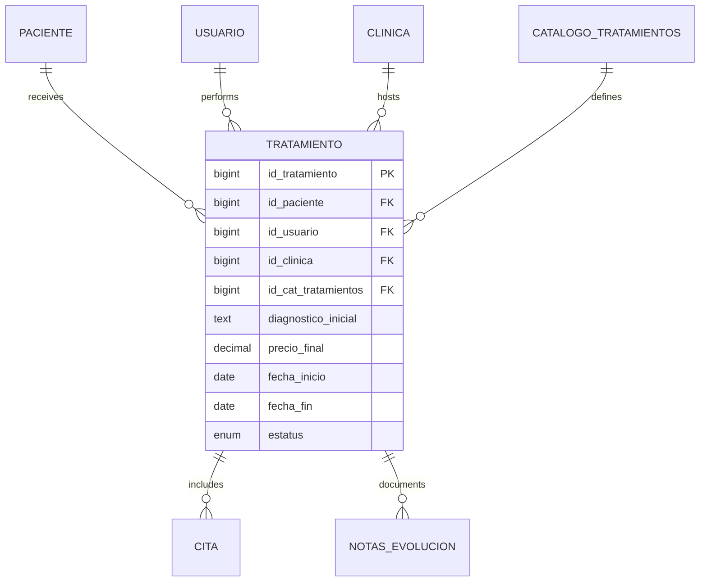
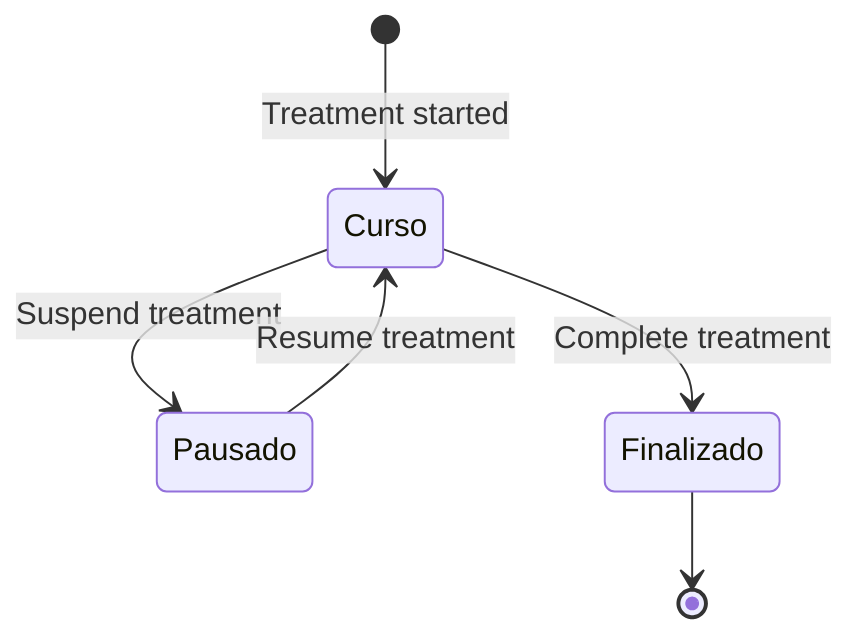

## Overview

The treatment system manages dental procedures from diagnosis through completion. It tracks treatment progress, pricing, status, and integrates with appointments and clinical notes for a complete care workflow.

<CardGroup cols={2}>
  <Card title="Treatment Plans" icon="clipboard-list">
    Track multi-session treatments from start to finish
  </Card>
  <Card title="Catalog System" icon="book-medical">
    Clinic-specific treatment catalogs with suggested pricing
  </Card>
  <Card title="Status Tracking" icon="list-check">
    Monitor treatments: in progress, completed, or paused
  </Card>
  <Card title="Evolution Notes" icon="notes-medical">
    Document treatment progress with detailed notes
  </Card>
</CardGroup>

## Data Model

The `Tratamiento` model tracks individual treatment instances for patients.

### Database Schema

See migration at `~/workspace/source/database/migrations/2026_02_23_092642_create_tratamiento_table.php:14-56`

```php
Schema::create('tratamiento', function (Blueprint $table) {
    $table->id('id_tratamiento');
    
    // Relationships
    $table->unsignedBigInteger('id_paciente');
    $table->unsignedBigInteger('id_usuario');
    $table->unsignedBigInteger('id_clinica');
    $table->unsignedBigInteger('id_cat_tratamientos');
    
    // Clinical information
    $table->text('diagnostico_inicial')->nullable();
    $table->decimal('precio_final', 10, 2)->nullable();
    
    $table->date('fecha_inicio')->nullable();
    $table->date('fecha_fin')->nullable();
    
    $table->enum('estatus', ['curso', 'finalizado', 'pausado'])
          ->default('curso');
    
    $table->timestamps();
    
    // Foreign keys with cascade
    $table->foreign('id_paciente')
          ->references('id_paciente')->on('paciente')
          ->onDelete('cascade');
    
    $table->foreign('id_usuario')
          ->references('id_usuario')->on('usuario')
          ->onDelete('cascade');
    
    $table->foreign('id_clinica')
          ->references('id_clinica')->on('clinica')
          ->onDelete('cascade');
    
    $table->foreign('id_cat_tratamientos')
          ->references('id_cat_tratamientos')->on('catalogo_tratamientos')
          ->onDelete('cascade');
});
```

### Model Attributes

See complete model at `~/workspace/source/app/Models/Tratamiento.php:17-27`

| Field | Type | Description |
|-------|------|-------------|
| `id_tratamiento` | bigint | Primary key |
| `id_paciente` | bigint | Patient receiving treatment (required) |
| `id_usuario` | bigint | Dentist performing treatment (required) |
| `id_clinica` | bigint | Clinic where treatment occurs (required) |
| `id_cat_tratamientos` | bigint | Treatment type from catalog (required) |
| `diagnostico_inicial` | text | Initial diagnosis notes |
| `precio_final` | decimal(10,2) | Final agreed price |
| `fecha_inicio` | date | Treatment start date |
| `fecha_fin` | date | Treatment completion date |
| `estatus` | enum | Status: `curso`, `finalizado`, `pausado` |

## Relationships

The Tratamiento model connects patients, providers, clinics, and catalogs.

### Belongs to Patient

See `~/workspace/source/app/Models/Tratamiento.php:31-34`

```php
public function paciente()
{
    return $this->belongsTo(Paciente::class, 'id_paciente', 'id_paciente');
}
```

### Belongs to Usuario (Dentist)

See `~/workspace/source/app/Models/Tratamiento.php:36-40`

```php
public function usuario()
{
    return $this->belongsTo(Usuario::class, 'id_usuario', 'id_usuario');
}
```

### Belongs to Clinic

See `~/workspace/source/app/Models/Tratamiento.php:42-46`

```php
public function clinica()
{
    return $this->belongsTo(Clinica::class, 'id_clinica', 'id_clinica');
}
```

### Belongs to Treatment Catalog

See `~/workspace/source/app/Models/Tratamiento.php:48-56`

```php
public function catalogoTratamiento()
{
    return $this->belongsTo(
        CatalogoTratamiento::class,
        'id_cat_tratamientos',
        'id_cat_tratamientos'
    );
}
```

### Has Many Appointments

See `~/workspace/source/app/Models/Tratamiento.php:58-62`

```php
public function citas()
{
    return $this->hasMany(Cita::class, 'id_tratamiento', 'id_tratamiento');
}
```

<Note>
A multi-session treatment (e.g., root canal, orthodontics) can have multiple appointments associated with it.
</Note>

### Has Many Evolution Notes

See `~/workspace/source/app/Models/Tratamiento.php:64-67`

```php
public function notasEvolucion()
{
    return $this->hasMany(NotasEvolucion::class, 'id_tratamiento', 'id_tratamiento');
}
```

## Entity Relationship Diagram



## Treatment Catalog

Each clinic maintains its own catalog of available treatments with suggested pricing.

### CatalogoTratamientos Schema

See migration at `~/workspace/source/database/migrations/2026_02_23_085812_create_catalogo_tratamientos_table.php:14-34`

```php
Schema::create('catalogo_tratamientos', function (Blueprint $table) {
    $table->id('id_cat_tratamientos');
    
    $table->unsignedBigInteger('id_clinica');
    
    $table->string('nombre');
    $table->text('descripcion')->nullable();
    $table->decimal('precio_sugerido', 10, 2)->nullable();
    $table->enum('estatus', ['activo', 'baja'])->default('activo');
    
    $table->timestamps();
    
    $table->foreign('id_clinica')
          ->references('id_clinica')->on('clinica')
          ->onDelete('cascade');
    
    $table->unique(['id_clinica', 'nombre']);
});
```

### Catalog Fields

| Field | Type | Description |
|-------|------|-------------|
| `id_cat_tratamientos` | bigint | Primary key |
| `id_clinica` | bigint | Owning clinic (required) |
| `nombre` | string | Treatment name (unique per clinic) |
| `descripcion` | text | Detailed description |
| `precio_sugerido` | decimal(10,2) | Suggested price (baseline) |
| `estatus` | enum | `activo` or `baja` |

### Example Catalog Entries

```php
// Creating treatment catalog entries for a clinic
CatalogoTratamiento::create([
    'id_clinica' => 1,
    'nombre' => 'Endodoncia (Conductos)',
    'descripcion' => 'Tratamiento de conducto radicular',
    'precio_sugerido' => 3500.00,
    'estatus' => 'activo'
]);

CatalogoTratamiento::create([
    'id_clinica' => 1,
    'nombre' => 'Ortodoncia Completa',
    'descripcion' => 'Tratamiento ortodóntico con brackets metálicos',
    'precio_sugerido' => 25000.00,
    'estatus' => 'activo'
]);

CatalogoTratamiento::create([
    'id_clinica' => 1,
    'nombre' => 'Extracción Simple',
    'descripcion' => 'Extracción de pieza dental sin complicaciones',
    'precio_sugerido' => 800.00,
    'estatus' => 'activo'
]);
```

<Note>
The unique constraint `['id_clinica', 'nombre']` means each clinic can have an "Ortodoncia" entry, but within a clinic, names must be unique.
</Note>

## Treatment Status Lifecycle

Treatments progress through three states:

<Steps>
  <Step title="Curso (In Progress)">
    Default state when treatment begins. Patient is actively receiving care.
  </Step>
  
  <Step title="Finalizado (Completed)">
    Treatment successfully concluded. `fecha_fin` should be set.
  </Step>
  
  <Step title="Pausado (Paused)">
    Treatment temporarily suspended (patient request, medical reasons, payment issues).
  </Step>
</Steps>

### Status Diagram



### Managing Status

```php
// Start treatment
$tratamiento = Tratamiento::create([
    'id_paciente' => $pacienteId,
    'id_usuario' => auth()->user()->id_usuario,
    'id_clinica' => auth()->user()->id_clinica,
    'id_cat_tratamientos' => $catalogoId,
    'diagnostico_inicial' => 'Caries profunda en molar #16',
    'precio_final' => 3500.00,
    'fecha_inicio' => now(),
    'estatus' => 'curso'
]);

// Pause treatment
$tratamiento->update(['estatus' => 'pausado']);

// Resume treatment
$tratamiento->update(['estatus' => 'curso']);

// Complete treatment
$tratamiento->update([
    'estatus' => 'finalizado',
    'fecha_fin' => now()
]);
```

## Pricing

The treatment model supports flexible pricing:

### Suggested vs Final Price

<CardGroup cols={2}>
  <Card title="Precio Sugerido" icon="tag">
    Baseline price from catalog (`catalogo_tratamientos.precio_sugerido`)
  </Card>
  <Card title="Precio Final" icon="dollar-sign">
    Actual negotiated price for this specific treatment instance
  </Card>
</CardGroup>

### Pricing Workflow

```php
// 1. Fetch catalog entry with suggested price
$catalogoTratamiento = CatalogoTratamiento::find($request->id_cat_tratamientos);

// 2. Use suggested price as default, allow override
$precioFinal = $request->precio_final ?? $catalogoTratamiento->precio_sugerido;

// 3. Create treatment with final price
$tratamiento = Tratamiento::create([
    'id_cat_tratamientos' => $catalogoTratamiento->id_cat_tratamientos,
    'precio_final' => $precioFinal,
    // ... other fields
]);
```

<Accordion title="When to Override Precio Sugerido">
  - Insurance coverage adjustments
  - Patient discounts or payment plans
  - Complexity variations (e.g., difficult extraction)
  - Promotional pricing
  - Senior/student discounts
</Accordion>

## Creating a Treatment

Typical treatment creation flow:

```php
public function store(Request $request)
{
    $validated = $request->validate([
        'id_paciente' => 'required|exists:paciente,id_paciente',
        'id_cat_tratamientos' => 'required|exists:catalogo_tratamientos,id_cat_tratamientos',
        'diagnostico_inicial' => 'required|string',
        'precio_final' => 'required|numeric|min:0',
        'fecha_inicio' => 'required|date',
    ]);
    
    $tratamiento = Tratamiento::create([
        'id_paciente' => $validated['id_paciente'],
        'id_usuario' => auth()->user()->id_usuario,
        'id_clinica' => auth()->user()->id_clinica,
        'id_cat_tratamientos' => $validated['id_cat_tratamientos'],
        'diagnostico_inicial' => $validated['diagnostico_inicial'],
        'precio_final' => $validated['precio_final'],
        'fecha_inicio' => $validated['fecha_inicio'],
        'estatus' => 'curso'
    ]);
    
    return redirect()->route('tratamientos.show', $tratamiento->id_tratamiento)
        ->with('success', 'Tratamiento iniciado correctamente.');
}
```

## Querying Treatments

### Active Treatments for Patient

```php
$tratamientosActivos = Tratamiento::where('id_paciente', $pacienteId)
    ->where('estatus', 'curso')
    ->with(['catalogoTratamiento', 'usuario'])
    ->get();
```

### Completed Treatments This Month

```php
$tratamientosCompletados = Tratamiento::where('id_clinica', $clinicaId)
    ->where('estatus', 'finalizado')
    ->whereMonth('fecha_fin', now()->month)
    ->whereYear('fecha_fin', now()->year)
    ->with(['paciente', 'catalogoTratamiento'])
    ->get();
```

### Treatments by Type

```php
$ortodoncias = Tratamiento::whereHas('catalogoTratamiento', function($q) {
    $q->where('nombre', 'LIKE', '%Ortodoncia%');
})
->where('id_clinica', $clinicaId)
->with(['paciente', 'usuario'])
->get();
```

### Revenue Summary

```php
$ingresosTotales = Tratamiento::where('id_clinica', $clinicaId)
    ->where('estatus', 'finalizado')
    ->sum('precio_final');

$ingresosPorTipo = Tratamiento::select(
        'id_cat_tratamientos',
        DB::raw('COUNT(*) as cantidad'),
        DB::raw('SUM(precio_final) as total')
    )
    ->where('id_clinica', $clinicaId)
    ->where('estatus', 'finalizado')
    ->groupBy('id_cat_tratamientos')
    ->with('catalogoTratamiento')
    ->get();
```

## Evolution Notes Integration

Treatments are documented through evolution notes (notas de evolución).

### NotasEvolucion Schema

See migration at `~/workspace/source/database/migrations/2026_02_23_093121_create_notas_evolucion_table.php`

```php
Schema::create('notas_evolucion', function (Blueprint $table) {
    $table->id('id_nota');
    
    $table->unsignedBigInteger('id_tratamiento');
    $table->unsignedBigInteger('id_usuario');
    
    $table->date('fecha');
    $table->time('hora');
    $table->text('nota_texto');
    $table->text('indicaciones')->nullable();
    
    $table->timestamps();
    
    $table->foreign('id_tratamiento')
          ->references('id_tratamiento')->on('tratamiento')
          ->onDelete('cascade');
    
    $table->foreign('id_usuario')
          ->references('id_usuario')->on('usuario')
          ->onDelete('cascade');
});
```

### Adding Evolution Notes

See model at `~/workspace/source/app/Models/NotasEvolucion.php:17-24`

```php
// After each treatment session, document progress
NotasEvolucion::create([
    'id_tratamiento' => $tratamientoId,
    'id_usuario' => auth()->user()->id_usuario,
    'fecha' => now()->toDateString(),
    'hora' => now()->toTimeString(),
    'nota_texto' => 'Sesión 2 de endodoncia. Instrumentación y obturación de conductos. Paciente toleró bien el procedimiento.',
    'indicaciones' => 'Tomar ibuprofeno 400mg cada 8 horas por 3 días. Evitar masticar del lado tratado.'
]);
```

### Viewing Treatment Timeline

```php
$tratamiento = Tratamiento::with([
    'notasEvolucion' => function($q) {
        $q->orderBy('fecha', 'desc')->orderBy('hora', 'desc');
    },
    'notasEvolucion.usuario'
])->find($id);

// Display chronological treatment history
foreach ($tratamiento->notasEvolucion as $nota) {
    echo "{$nota->fecha} {$nota->hora} - Dr. {$nota->usuario->nombre}";
    echo "\n{$nota->nota_texto}";
    if ($nota->indicaciones) {
        echo "\nIndicaciones: {$nota->indicaciones}";
    }
}
```

## Multi-Session Treatments

Complex treatments require multiple appointments:

```php
// 1. Create treatment plan
$tratamiento = Tratamiento::create([
    'id_paciente' => $pacienteId,
    'id_cat_tratamientos' => $catalogoId, // e.g., "Root Canal"
    'diagnostico_inicial' => 'Necrosis pulpar en molar #36',
    'precio_final' => 3500.00,
    'fecha_inicio' => now(),
    'estatus' => 'curso'
]);

// 2. Schedule first appointment
$cita1 = Cita::create([
    'id_tratamiento' => $tratamiento->id_tratamiento,
    'id_paciente' => $pacienteId,
    'id_usuario' => $dentistaId,
    'fecha' => '2026-03-15',
    'hora' => '10:00',
    'motivo_consulta' => 'Endodoncia - Sesión 1: Apertura y conductometría'
]);

// 3. Schedule second appointment
$cita2 = Cita::create([
    'id_tratamiento' => $tratamiento->id_tratamiento,
    'id_paciente' => $pacienteId,
    'id_usuario' => $dentistaId,
    'fecha' => '2026-03-22',
    'hora' => '10:00',
    'motivo_consulta' => 'Endodoncia - Sesión 2: Instrumentación'
]);

// 4. After each session, add evolution note
// (see Evolution Notes section above)
```

## Best Practices

<AccordionGroup>
  <Accordion title="Always Link to Catalog">
    Never create free-form treatment names. Always reference `catalogo_tratamientos` for consistency and reporting.
  </Accordion>
  
  <Accordion title="Document Initial Diagnosis">
    The `diagnostico_inicial` field is critical for:
    - Clinical decision-making
    - Insurance claims
    - Legal documentation
    - Treatment outcome tracking
  </Accordion>
  
  <Accordion title="Set Fecha Fin on Completion">
    Always update `fecha_fin` when marking a treatment as `finalizado`:
    
    ```php
    $tratamiento->update([
        'estatus' => 'finalizado',
        'fecha_fin' => now()
    ]);
    ```
  </Accordion>
  
  <Accordion title="Use Evolution Notes Liberally">
    Document every significant event:
    - Each appointment/session
    - Complications or changes in plan
    - Patient reactions or concerns
    - Treatment modifications
  </Accordion>
  
  <Accordion title="Maintain Catalog Hygiene">
    - Use `estatus = 'baja'` for discontinued treatments instead of deleting
    - Keep names consistent (e.g., always "Ortodoncia", not sometimes "Brackets")
    - Review and update `precio_sugerido` periodically
  </Accordion>
</AccordionGroup>

## Reporting Queries

### Treatments in Progress

```php
$enCurso = Tratamiento::where('id_clinica', $clinicaId)
    ->where('estatus', 'curso')
    ->with(['paciente', 'catalogoTratamiento', 'usuario'])
    ->get();
```

### Average Treatment Duration

```php
$duracionPromedio = Tratamiento::where('id_clinica', $clinicaId)
    ->where('estatus', 'finalizado')
    ->whereNotNull('fecha_inicio')
    ->whereNotNull('fecha_fin')
    ->selectRaw('AVG(DATEDIFF(fecha_fin, fecha_inicio)) as dias_promedio')
    ->first()
    ->dias_promedio;
```

### Most Common Treatments

```php
$tratamientosPopulares = Tratamiento::select(
        'id_cat_tratamientos',
        DB::raw('COUNT(*) as total')
    )
    ->where('id_clinica', $clinicaId)
    ->groupBy('id_cat_tratamientos')
    ->orderBy('total', 'desc')
    ->with('catalogoTratamiento')
    ->take(10)
    ->get();
```

## Related Features

<CardGroup cols={3}>
  <Card title="Patient Management" icon="user" href="/features/patient-management">
    Manage patients receiving treatments
  </Card>
  <Card title="Appointments" icon="calendar" href="/features/appointments">
    Schedule treatment sessions
  </Card>
  <Card title="Clinical Records" icon="file-medical" href="/features/clinical-records">
    Document treatment progress
  </Card>
</CardGroup>