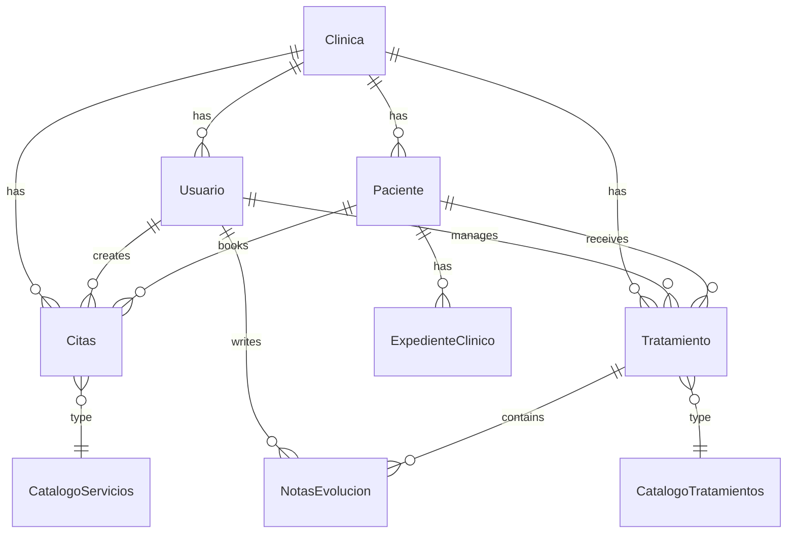

# Database Setup

DentControl uses Laravel's migration system to manage database schema. This guide covers database configuration, running migrations, and understanding the database structure.

## Database Options

DentControl supports multiple database systems out of the box.

### Supported Databases

<CardGroup cols={3}>
  <Card title="SQLite" icon="database">
    **Default choice**
    
    Single file database, perfect for development and small deployments. No server required.
  </Card>
  
  <Card title="MySQL" icon="server">
    **Production ready**
    
    Popular relational database with excellent performance and wide hosting support.
  </Card>
  
  <Card title="PostgreSQL" icon="elephant">
    **Advanced features**
    
    Robust database with advanced features and strong data integrity.
  </Card>
</CardGroup>

### SQLite Setup (Default)

SQLite is the default database and requires minimal configuration.

<Steps>
  <Step title="Configure .env">
    Set the database connection in `.env`:
    
    ```env
    DB_CONNECTION=sqlite
    ```
  </Step>

  <Step title="Create database file">
    Create the SQLite database file:
    
    ```bash
    touch database/database.sqlite
    ```
  </Step>

  <Step title="Set permissions">
    Ensure the database file is writable:
    
    ```bash
    chmod 664 database/database.sqlite
    chmod 775 database/
    ```
  </Step>
</Steps>

<Note>
  SQLite stores the entire database in a single file at `database/database.sqlite`.
</Note>

### MySQL Setup

<Steps>
  <Step title="Create database">
    Create a MySQL database:
    
    ```sql
    CREATE DATABASE dentcontrol CHARACTER SET utf8mb4 COLLATE utf8mb4_unicode_ci;
    CREATE USER 'dentcontrol'@'localhost' IDENTIFIED BY 'secure_password';
    GRANT ALL PRIVILEGES ON dentcontrol.* TO 'dentcontrol'@'localhost';
    FLUSH PRIVILEGES;
    ```
  </Step>

  <Step title="Configure .env">
    Update your `.env` file:
    
    ```env
    DB_CONNECTION=mysql
    DB_HOST=127.0.0.1
    DB_PORT=3306
    DB_DATABASE=dentcontrol
    DB_USERNAME=dentcontrol
    DB_PASSWORD=secure_password
    ```
  </Step>

  <Step title="Test connection">
    Test the database connection:
    
    ```bash
    php artisan db:show
    ```
  </Step>
</Steps>

### PostgreSQL Setup

<Steps>
  <Step title="Create database">
    Create a PostgreSQL database:
    
    ```sql
    CREATE DATABASE dentcontrol;
    CREATE USER dentcontrol WITH PASSWORD 'secure_password';
    GRANT ALL PRIVILEGES ON DATABASE dentcontrol TO dentcontrol;
    ```
  </Step>

  <Step title="Configure .env">
    Update your `.env` file:
    
    ```env
    DB_CONNECTION=pgsql
    DB_HOST=127.0.0.1
    DB_PORT=5432
    DB_DATABASE=dentcontrol
    DB_USERNAME=dentcontrol
    DB_PASSWORD=secure_password
    ```
  </Step>

  <Step title="Test connection">
    Verify the connection:
    
    ```bash
    php artisan db:show
    ```
  </Step>
</Steps>

## Running Migrations

Migrations create and modify database tables. DentControl includes all necessary migrations.

### Initial Migration

Run migrations for the first time:

<CodeGroup>
```bash Basic Migration
php artisan migrate
```

```bash Force Migration (Production)
php artisan migrate --force
```

```bash Migration with Seeding
php artisan migrate --seed
```
</CodeGroup>

<Warning>
  On production servers, Laravel requires the `--force` flag to run migrations:
  
  ```bash
  php artisan migrate --force
  ```
</Warning>

### Migration Commands

| Command | Description |
|---------|-------------|
| `php artisan migrate` | Run pending migrations |
| `php artisan migrate:status` | Show migration status |
| `php artisan migrate:rollback` | Rollback last batch |
| `php artisan migrate:reset` | Rollback all migrations |
| `php artisan migrate:refresh` | Reset and re-run all migrations |
| `php artisan migrate:fresh` | Drop all tables and re-migrate |

<Note>
  Use `migrate:fresh` with caution - it **deletes all data**!
</Note>

## Migration File Structure

DentControl includes the following migrations (in execution order):

### Laravel System Tables

```text System Migrations
0001_01_01_000000_create_users_table.php       # Default Laravel users (not used)
0001_01_01_000001_create_cache_table.php       # Cache storage
0001_01_01_000002_create_jobs_table.php        # Queue jobs and batches
```

### DentControl Application Tables

<Steps>
  <Step title="Clinica (Clinic)">
    **File**: `2026_02_23_084014_create_clinica_table.php`
    
    The root table for multi-clinic support. Stores clinic information, address, and status.
    
    ```sql Key Fields
    - id_clinica (primary key)
    - nombre (clinic name)
    - rfc (tax ID, unique)
    - Address fields (calle, ciudad, estado, etc.)
    - telefono
    - logo_ruta
    - estatus (activo/baja)
    ```
  </Step>

  <Step title="Catalogo Servicios (Service Catalog)">
    **File**: `2026_02_23_085029_create_catalogo_servicios_table.php`
    
    Services offered by each clinic (e.g., "Limpieza", "Ortodoncia").
    
    ```sql Key Fields
    - id_cat_servicio (primary key)
    - id_clinica (foreign key)
    - nombre (service name, unique per clinic)
    - descripcion
    - duracion (duration in minutes)
    - precio_sugerido
    - estatus
    ```
  </Step>

  <Step title="Catalogo Tratamientos (Treatment Catalog)">
    **File**: `2026_02_23_085812_create_catalogo_tratamientos_table.php`
    
    Treatment types offered by clinics.
  </Step>

  <Step title="Paciente (Patient)">
    **File**: `2026_02_23_090302_create_paciente_table.php`
    
    Patient information and medical records.
    
    ```sql Key Fields
    - id_paciente (primary key)
    - id_clinica (foreign key)
    - Personal info (nombre, apellidos, fecha_nacimiento, sexo)
    - curp (unique national ID)
    - telefono, ocupacion, peso
    - Address fields
    - estatus
    ```
  </Step>

  <Step title="Usuario (User)">
    **File**: `2026_02_23_090927_create_usuario_table.php`
    
    System users (dentists, assistants, admins).
    
    ```sql Key Fields
    - id_usuario (primary key)
    - id_clinica (foreign key)
    - Personal info (nombre, apellidos)
    - cedula_profesional (professional license, unique)
    - nom_usuario (username, unique)
    - password (hashed)
    - rol (superadmin, dentista, asistente)
    - estatus
    - remember_token
    ```
  </Step>

  <Step title="Expediente Clinico (Clinical Record)">
    **File**: `2026_02_23_092325_create_expediente_clinico_table.php`
    
    Patient medical history and clinical information.
  </Step>

  <Step title="Tratamiento (Treatment)">
    **File**: `2026_02_23_092642_create_tratamiento_table.php`
    
    Active treatments for patients.
    
    ```sql Key Fields
    - id_tratamiento (primary key)
    - id_paciente, id_usuario, id_clinica (foreign keys)
    - id_cat_tratamientos (treatment type)
    - diagnostico_inicial
    - precio_final
    - fecha_inicio, fecha_fin
    - estatus (curso, finalizado, pausado)
    ```
  </Step>

  <Step title="Notas Evolucion (Clinical Notes)">
    **File**: `2026_02_23_093121_create_notas_evolucion_table.php`
    
    Progress notes for treatments.
  </Step>

  <Step title="Acceso Movil (Mobile Access)">
    **File**: `2026_02_23_093639_create_acceso_movil_table.php`
    
    Mobile app access tokens.
  </Step>

  <Step title="Citas (Appointments)">
    **File**: `2026_03_01_231623_create_citas_table.php`
    
    Patient appointments with dentists.
    
    ```sql Key Fields
    - id_cita (primary key)
    - id_paciente, id_usuario, id_clinica (foreign keys)
    - id_cat_servicio (service type)
    - id_tratamiento (optional, linked treatment)
    - fecha (date)
    - hora (time)
    - motivo_consulta
    - Unique constraint: (id_usuario, fecha, hora)
    ```
  </Step>
</Steps>

## Database Schema Overview

Here's how the main tables relate to each other:



### Key Relationships

1. **Clinic-centric**: All major entities belong to a clinic (`id_clinica`)
2. **User assignments**: Users (dentists/assistants) are assigned to one clinic
3. **Patient records**: Patients belong to a clinic and have multiple appointments
4. **Appointments**: Link patients, users (dentists), services, and optionally treatments
5. **Treatments**: Ongoing treatment plans with clinical notes
6. **Cascade deletes**: Most tables use `onDelete('cascade')` for referential integrity

## Seeding Data

Seeders populate the database with initial or test data.

### Running Seeders

<CodeGroup>
```bash Run All Seeders
php artisan db:seed
```

```bash Run Specific Seeder
php artisan db:seed --class=UsuarioSeeder
```

```bash Migrate and Seed
php artisan migrate:fresh --seed
```
</CodeGroup>

### Creating Custom Seeders

Create a seeder for initial data:

<CodeGroup>
```bash Generate Seeder
php artisan make:seeder ClinicaSeeder
```

```php Example Seeder
<?php

namespace Database\Seeders;

use Illuminate\Database\Seeder;
use App\Models\Clinica;

class ClinicaSeeder extends Seeder
{
    public function run(): void
    {
        Clinica::create([
            'nombre' => 'Clínica Dental Centro',
            'rfc' => 'CDC850101ABC',
            'calle' => 'Av. Principal',
            'numero_ext' => '123',
            'ciudad' => 'Ciudad de México',
            'estado' => 'CDMX',
            'telefono' => '5512345678',
            'estatus' => 'activo'
        ]);
    }
}
```

```php DatabaseSeeder.php
public function run(): void
{
    $this->call([
        ClinicaSeeder::class,
        UsuarioSeeder::class,
        PacienteSeeder::class,
    ]);
}
```
</CodeGroup>

## Database Maintenance

### Backup Database

<CodeGroup>
```bash SQLite Backup
cp database/database.sqlite database/backups/backup-$(date +%Y%m%d).sqlite
```

```bash MySQL Backup
mysqldump -u dentcontrol -p dentcontrol > backup-$(date +%Y%m%d).sql
```

```bash PostgreSQL Backup
pg_dump dentcontrol > backup-$(date +%Y%m%d).sql
```
</CodeGroup>

### Restore Database

<CodeGroup>
```bash SQLite Restore
cp database/backups/backup-20260305.sqlite database/database.sqlite
```

```bash MySQL Restore
mysql -u dentcontrol -p dentcontrol < backup-20260305.sql
```

```bash PostgreSQL Restore
psql dentcontrol < backup-20260305.sql
```
</CodeGroup>

### Database Optimization

```bash Optimize Database
# Clear old cache entries
php artisan cache:clear

# Clear old job records
php artisan queue:flush

# Optimize database (MySQL)
php artisan db:optimize
```

## Database Inspection

### Using Artisan Commands

<CodeGroup>
```bash Show Database Info
php artisan db:show
```

```bash Show Table Details
php artisan db:table usuario
```

```bash Monitor Database
php artisan db:monitor --databases=mysql
```
</CodeGroup>

### Using Tinker

Interact with your database using Laravel Tinker:

<CodeGroup>
```bash Start Tinker
php artisan tinker
```

```php Query Examples
// Count users
App\Models\Usuario::count();

// Get active clinics
App\Models\Clinica::where('estatus', 'activo')->get();

// Find user with relationships
$usuario = App\Models\Usuario::with('clinica', 'citas')->find(1);

// Create test record
App\Models\Clinica::create([
    'nombre' => 'Test Clinic',
    'estatus' => 'activo'
]);
```
</CodeGroup>

## Troubleshooting

<Accordion title="Migration fails - table already exists">
  This means migrations were partially run. Options:
  
  1. **Check migration status**:
     ```bash
     php artisan migrate:status
     ```
  
  2. **Rollback and retry**:
     ```bash
     php artisan migrate:rollback
     php artisan migrate
     ```
  
  3. **Fresh start (destroys data!)**:
     ```bash
     php artisan migrate:fresh
     ```
</Accordion>

<Accordion title="SQLite database locked">
  SQLite locks the entire database during writes.
  
  Solutions:
  1. Close any database browser tools
  2. Stop any running queue workers
  3. Check file permissions:
     ```bash
     chmod 664 database/database.sqlite
     ```
  4. For production, consider MySQL or PostgreSQL
</Accordion>

<Accordion title="Foreign key constraint fails">
  This occurs when trying to insert data without required parent records.
  
  Example: Creating a user without a clinic:
  
  ```php
  // This will fail:
  Usuario::create(['id_clinica' => 999, ...]);
  
  // First create the clinic:
  $clinica = Clinica::create(['nombre' => 'My Clinic', ...]);
  
  // Then create the user:
  Usuario::create(['id_clinica' => $clinica->id_clinica, ...]);
  ```
  
  Order matters! Create parent records first:
  1. Clinica
  2. CatalogoServicios, CatalogoTratamientos
  3. Usuario, Paciente
  4. ExpedienteClinico, Tratamiento
  5. Citas, NotasEvolucion
</Accordion>

<Accordion title="Migration timeout on large databases">
  For large migrations, increase timeout:
  
  ```php
  // In migration file
  public function up(): void
  {
      DB::statement('SET SESSION max_execution_time = 600;');
      Schema::create('large_table', function (Blueprint $table) {
          // ...
      });
  }
  ```
  
  Or run migrations with higher limits:
  ```bash
  php -d max_execution_time=600 artisan migrate
  ```
</Accordion>

<Accordion title="Cannot connect to database">
  Check these common issues:
  
  1. **Database server running?**
     ```bash
     # MySQL
     sudo systemctl status mysql
     
     # PostgreSQL
     sudo systemctl status postgresql
     ```
  
  2. **Credentials correct?**
     - Verify `.env` settings
     - Test with database client
  
  3. **Firewall blocking?**
     ```bash
     # Check MySQL port
     sudo netstat -tlnp | grep 3306
     
     # Check PostgreSQL port  
     sudo netstat -tlnp | grep 5432
     ```
  
  4. **Clear config cache**:
     ```bash
     php artisan config:clear
     ```
</Accordion>

<Accordion title="Character encoding issues">
  Ensure UTF-8 encoding for proper Spanish character support:
  
  **MySQL**:
  ```sql
  ALTER DATABASE dentcontrol CHARACTER SET utf8mb4 COLLATE utf8mb4_unicode_ci;
  ```
  
  **PostgreSQL**:
  ```sql
  -- Create database with UTF-8
  CREATE DATABASE dentcontrol ENCODING 'UTF8';
  ```
  
  **SQLite**: UTF-8 by default
</Accordion>

## Best Practices

1. **Always backup before migrations**: Especially on production
2. **Test migrations locally first**: Run on dev environment before production
3. **Use transactions**: Migrations automatically wrap operations in transactions
4. **Version control migrations**: Never modify existing migrations, create new ones
5. **Document custom migrations**: Add comments explaining complex schema changes
6. **Regular backups**: Automate daily database backups
7. **Monitor database size**: Watch SQLite file size, consider MySQL/PostgreSQL for growth
8. **Use seeders for initial data**: Keep test data consistent across environments

## Next Steps

<CardGroup cols={2}>
  <Card title="Configuration" icon="gear" href="/guides/configuration">
    Configure database connection settings
  </Card>
  
  <Card title="User Management" icon="users" href="/guides/user-management">
    Create users and manage access
  </Card>
  
  <Card title="Deployment" icon="rocket" href="/guides/deployment">
    Deploy your database to production
  </Card>
</CardGroup>