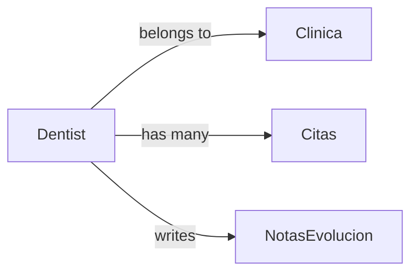

## Overview

The **Dentist** (dentista) role is designed for dental professionals who manage their own clinic within the DentControl SaaS platform. Dentists have full access to their clinic's patient records, treatments, and clinical data, but are restricted to their assigned clinic only.

<Info>
  Dentists are the primary clinical users of the system and have the highest level of access within their assigned clinic.
</Info>

## Key Characteristics

<CardGroup cols={2}>
  <Card title="Clinic-Specific Access" icon="building">
    Full access to all data within their assigned clinic (id_clinica)
  </Card>
  <Card title="Patient Management" icon="user-doctor">
    Create, view, edit, and manage patient records and clinical histories
  </Card>
  <Card title="Professional License" icon="id-card">
    Required to have a valid cedula_profesional (7-10 digits)
  </Card>
  <Card title="Clinical Records" icon="file-medical">
    Full access to treatment plans, evolution notes, and medical records
  </Card>
</CardGroup>

## Accessible Routes

Dentist routes are protected by the `can:dentista-only` middleware, which verifies the user's role is `dentista`.

### Dashboard
```
GET /dentista/dashboard
```
View clinic-specific statistics including:
- Today's appointments (`citasHoy`)
- Total patients in the clinic (`totalPacientes`)
- Active treatments (`tratamientosActivos`)
- System alerts and notifications

Implemented in: `app/Http/Controllers/Clinica/DashboardController.php:12`

<Note>
  The dashboard displays only data from the dentist's assigned clinic (filtered by `id_clinica`).
</Note>

### Patient Management

```
GET /pacientes
```
**Controller:** `PacienteController@index`

**Purpose:** View and manage all patients registered in the dentist's clinic

**Data Scope:** Filtered by `id_clinica` to show only the clinic's patients

**Source:** `routes/web.php:39`

<AccordionGroup>
  <Accordion title="Patient Data Model">
    Patients are stored in the `paciente` table with the following key fields:
    
    **Demographics:**
    - `nombre`, `apellido_paterno`, `apellido_materno`
    - `fecha_nacimiento`, `sexo`
    - `curp`, `telefono`, `ocupacion`
    
    **Address:**
    - `calle`, `num_ext`, `num_int`
    - `colonia`, `ciudad`, `estado`, `codigo_postal`
    
    **Clinical:**
    - `peso` (weight)
    - `estatus` (active/inactive)
    - `id_clinica` (clinic association)
    
    **Source:** `app/Models/Paciente.php:16`
  </Accordion>

  <Accordion title="Patient Relationships">
    Each patient can have:
    
    - **Appointments** (`citas`): Multiple appointments scheduled
    - **Clinical Record** (`expediente`): One clinical file with medical history
    - **Mobile Access** (`accesoMovil`): Optional patient portal credentials
    - **Clinic** (`clinica`): Belongs to the dentist's clinic
    
    **Source:** `app/Models/Paciente.php:44`
  </Accordion>
</AccordionGroup>

## Clinical Capabilities

While the codebase is still in development, dentists are designed to have access to:

<CardGroup cols={2}>
  <Card title="Treatment Planning" icon="clipboard-list">
    Create and manage treatment plans for patients (via `Tratamiento` model)
  </Card>
  <Card title="Evolution Notes" icon="notes-medical">
    Record clinical progress and observations (via `NotasEvolucion` model)
  </Card>
  <Card title="Appointment Management" icon="calendar-check">
    View and manage appointments (via `Cita` model)
  </Card>
  <Card title="Clinical Records" icon="folder-open">
    Access complete patient medical histories (via `ExpedienteClinico` model)
  </Card>
</CardGroup>

## Permission Boundaries

<Warning>
  **Restrictions:**
  - Cannot access patients from other clinics
  - Cannot modify clinic settings or logo
  - Cannot create or manage other users
  - Cannot access Super Admin routes (`/admin/*`)
  - Cannot access Assistant-only routes (`/asistente/*`)
</Warning>

<Info>
  **Access Requirements:**
  - Account status must be `'activo'`
  - Associated clinic status must be `'activo'`
  - Must be logged in with valid session
</Info>

## Authentication & Authorization

### Gate Definition

The `dentista-only` gate is defined in `AppServiceProvider.php:30`:

```php
Gate::define('dentista-only', function ($user) {
    return $user->rol === 'dentista';
});
```

### Login Redirection

After successful authentication, Dentists are redirected to:
```
/dentista/dashboard
```

Implemented in: `AuthController.php:68`

### Session Validation

Dentists cannot log in if:
1. Their user status is not `'activo'` (checked at `AuthController.php:33`)
2. Their clinic status is `'baja'` (checked at `AuthController.php:41`)

## Database Schema

Dentist users are stored in the `usuario` table:

| Field | Description | Required |
|-------|-------------|----------|
| `id_usuario` | Primary key | ✓ |
| `id_clinica` | Foreign key to clinic | ✓ |
| `nombre` | First name | ✓ |
| `apellido_paterno` | Paternal surname | ✓ |
| `apellido_materno` | Maternal surname | Optional |
| `cedula_profesional` | Professional license (7-10 digits) | ✓ |
| `nom_usuario` | Username (4-20 alphanumeric) | ✓ |
| `password` | Hashed password | ✓ |
| `rol` | Must be `'dentista'` | ✓ |
| `estatus` | `'activo'` or `'baja'` | ✓ |

**Source:** `app/Models/Usuario.php:21`

## User Relationships



## Creating Dentist Accounts

Dentist accounts can only be created by Super Admins via:

```
POST /usuarios
```

**Required Fields:**
- `id_clinica` - Must be an active clinic
- `nombre` - Min 3 chars, letters only
- `apellido_paterno` - Min 3 chars, letters only
- `nom_usuario` - 4-20 alphanumeric, unique
- `password` - Min 8 chars, mixed case, numbers
- `rol` - Set to `'dentista'`
- `cedula_profesional` - 7-10 digits

**Source:** `app/Http/Controllers/Admin/UsuarioController.php:26`

## Account Management

### Status Toggle

Super Admins can suspend or reactivate dentist accounts:

```
PATCH /usuarios/{id}/toggle
```

This switches the `estatus` between `'activo'` and `'baja'`. When suspended, the dentist cannot log in.

**Source:** `app/Http/Controllers/Admin/UsuarioController.php:91`

### Profile Updates

Dentists cannot update their own profiles. Updates must be performed by Super Admins via:

```
PUT /usuarios/{id}
```

## Best Practices

<Card title="Professional License" icon="shield-check">
  Always verify that the cedula_profesional is valid and belongs to the dentist before creating the account.
</Card>

<Card title="Data Security" icon="lock">
  Dentists should only access patient data within their clinic. The system enforces this through middleware and database queries filtered by `id_clinica`.
</Card>

<Card title="Password Security" icon="key">
  Passwords are automatically hashed using Laravel's built-in hashing (defined in Usuario model as `'password' => 'hashed'`).
</Card>

## Future Capabilities

Based on the data models, dentists will eventually have access to:

- Full CRUD operations on patients
- Treatment plan creation and modification
- Clinical note writing and evolution tracking
- Appointment scheduling and management
- X-ray and document uploads
- Billing and payment tracking

## Related Documentation

- [Super Admin Role](/roles/super-admin) - Platform-level management
- [Assistant Role](/roles/assistant) - Reception and scheduling support
- [Patient Access](/roles/patient-access) - Patient portal capabilities
- [Patient Management](/features/patient-management) - Detailed patient operations