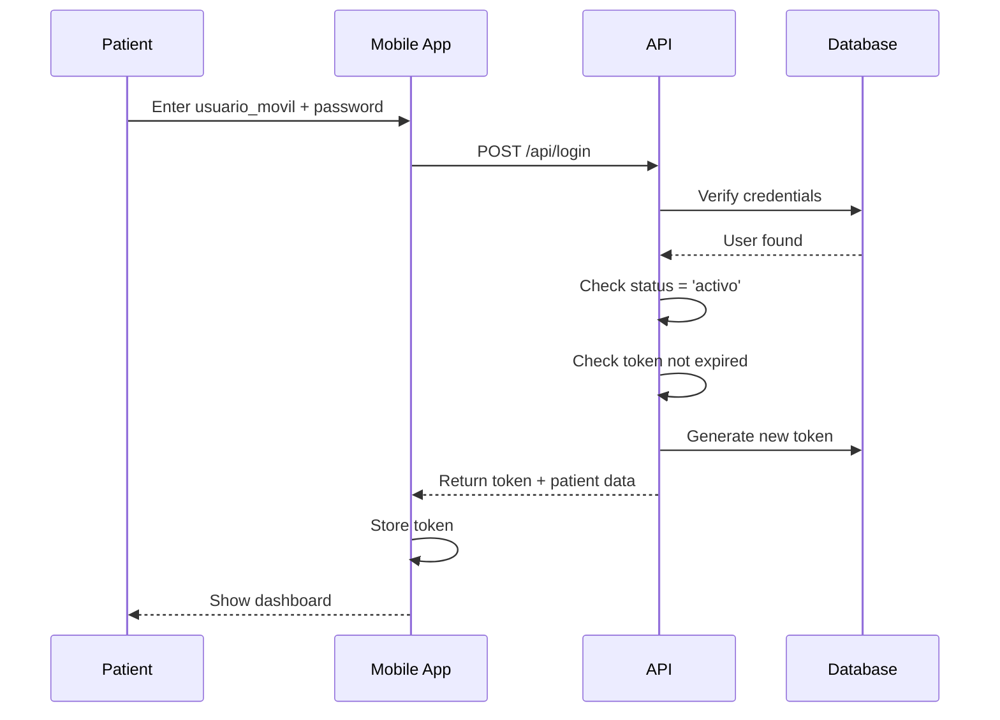

## Overview

The **Patient Mobile Access** system (AccesoMovil) provides patients with secure, read-only access to their personal dental records through a mobile-friendly interface. This feature enhances patient engagement and reduces administrative burden by allowing patients to self-serve basic information.

<Info>
  Patient access is **optional** and must be explicitly created by clinic staff. Not all patients will have mobile access by default.
</Info>

## Key Characteristics

<CardGroup cols={2}>
  <Card title="Mobile-First Design" icon="mobile">
    Optimized for smartphone and tablet access
  </Card>
  <Card title="Read-Only Access" icon="eye">
    Patients can view but not modify their records
  </Card>
  <Card title="Token-Based Auth" icon="key">
    Secure authentication using tokens with expiration
  </Card>
  <Card title="Self-Service Portal" icon="user">
    View appointments, treatments, and personal information
  </Card>
</CardGroup>

## Database Schema

Patient access credentials are stored in the `acceso_movil` table:

| Field | Type | Description |
|-------|------|-------------|
| `id_acceso` | INT (PK) | Primary key |
| `id_paciente` | INT (FK) | Foreign key to patient record |
| `usuario_movil` | VARCHAR | Patient's username for mobile login |
| `password` | VARCHAR | Hashed password (hidden) |
| `token` | VARCHAR | Session token for API access (hidden) |
| `fecha_expiracion` | DATETIME | Token expiration date |
| `estatus` | ENUM | 'activo' or 'inactivo' |
| `created_at` | TIMESTAMP | Account creation date |
| `updated_at` | TIMESTAMP | Last modification date |

**Source:** `app/Models/AccesoMovil.php:10`

## Model Relationships

```php
// AccesoMovil belongs to one Patient
public function paciente()
{
    return $this->belongsTo(Paciente::class, 'id_paciente', 'id_paciente');
}
```

```php
// Patient has one AccesoMovil (optional)
public function accesoMovil()
{
    return $this->hasOne(AccesoMovil::class, 'id_paciente', 'id_paciente');
}
```

**Source:** `app/Models/AccesoMovil.php:33`, `app/Models/Paciente.php:57`

## Security Features

### Password Hashing

Passwords are automatically hashed when set:

```php
public function setPasswordAttribute($value)
{
    $this->attributes['password'] = Hash::make($value);
}
```

**Source:** `app/Models/AccesoMovil.php:39`

### Hidden Fields

Sensitive fields are hidden from JSON responses:

```php
protected $hidden = [
    'password',
    'token'
];
```

**Source:** `app/Models/AccesoMovil.php:26`

### Token Expiration

Access tokens have an expiration date (`fecha_expiracion`) to ensure sessions don't remain active indefinitely.

<Warning>
  Tokens should be regenerated periodically and expired tokens should be rejected during authentication.
</Warning>

## What Patients Can Access

<AccordionGroup>
  <Accordion title="Personal Information">
    **Read-only access to:**
    - Name and demographics
    - Contact information (phone, address)
    - Date of birth and age
    - CURP and identification
    
    **Cannot modify:** Patients cannot edit their own information; changes must be requested through the clinic
  </Accordion>

  <Accordion title="Appointment History">
    **Can view:**
    - Upcoming appointments (date, time, dentist)
    - Past appointment history
    - Appointment status (scheduled, completed, cancelled)
    
    **Cannot do:**
    - Schedule new appointments (must call clinic)
    - Cancel or reschedule appointments
    - View other patients' appointments
  </Accordion>

  <Accordion title="Treatment Information">
    **Can view:**
    - Active treatment plans
    - Completed treatments
    - Treatment descriptions and procedures
    - Treatment dates
    
    **Cannot access:**
    - Detailed clinical notes from dentists
    - Internal diagnosis codes
    - Pricing information (optional, depends on implementation)
  </Accordion>

  <Accordion title="Clinical Records">
    **Limited access to:**
    - Basic medical history they provided
    - Allergies and medications
    - General health questionnaire responses
    
    **Cannot view:**
    - Dentist's private notes
    - Detailed diagnostic evaluations
    - X-ray interpretations
    - Treatment recommendations (unless explicitly shared)
  </Accordion>
</AccordionGroup>

## Permission Boundaries

<Card title="Strict Read-Only Access" icon="lock">
  Patients can **only view** their own data. They cannot:
  - Modify any personal information
  - Edit treatment plans
  - Add or remove appointments
  - Access other patients' data
  - View clinic staff information
  - Access administrative functions
</Card>

## Data Scope Restrictions

All patient queries must be filtered by `id_paciente` to ensure patients only see their own data:

```php
// Example: Get patient's appointments
$citas = Cita::where('id_paciente', $patient->id_paciente)->get();

// Example: Get patient's treatments
$tratamientos = Tratamiento::where('id_paciente', $patient->id_paciente)->get();
```

<Warning>
  **Critical Security Rule:** Always verify that the authenticated patient's `id_paciente` matches the requested resource before returning any data.
</Warning>

## Creating Patient Access

Patient access accounts should be created by clinic staff (Dentist or Assistant) when:
- A patient requests mobile access
- The clinic wants to provide digital records
- The patient needs to monitor their treatment progress

### Account Creation Process

<Steps>
  <Step title="Verify Patient Record">
    Ensure the patient exists in the `paciente` table and belongs to your clinic
  </Step>
  <Step title="Generate Credentials">
    Create a unique `usuario_movil` (username) and secure password
  </Step>
  <Step title="Set Expiration">
    Define token expiration date (e.g., 90 days, 1 year, or never)
  </Step>
  <Step title="Activate Account">
    Set `estatus` to 'activo'
  </Step>
  <Step title="Provide Credentials">
    Securely deliver username and temporary password to patient
  </Step>
</Steps>

### Recommended Username Format

Consider using a consistent format for patient usernames:
- Email address: `juan.perez@email.com`
- Phone number: `5551234567`
- Custom format: `paciente_12345` or `jperez_clinic123`

## Authentication Flow



## Account Status Management

### Active Status
Patients with `estatus = 'activo'` can log in and access their data.

### Inactive Status
Patients with `estatus = 'inactivo'` cannot log in. Use this to:
- Temporarily disable access
- Suspend patients who haven't paid
- Deactivate accounts for patients who left the clinic

### Reactivation
Clinic staff can toggle the status back to 'activo' at any time.

## Privacy & Compliance

<Card title="HIPAA/Privacy Considerations" icon="user-shield">
  When implementing patient mobile access:
  
  - **Data Encryption:** Use HTTPS/TLS for all API communications
  - **Access Logs:** Track when patients access their records
  - **Password Requirements:** Enforce strong passwords
  - **Session Timeouts:** Auto-logout after inactivity
  - **Two-Factor Auth:** Consider adding 2FA for sensitive data
</Card>

## Best Practices

1. **Token Rotation**: Regenerate tokens periodically (e.g., every 90 days)
2. **Password Reset**: Provide a secure password reset mechanism
3. **Session Management**: Implement proper session timeout (e.g., 15-30 minutes of inactivity)
4. **Audit Trail**: Log all patient access to sensitive data
5. **Data Minimization**: Only expose necessary information; hide internal codes and staff notes
6. **Terms of Service**: Require patients to accept terms before first access

## Mobile App Features

The patient mobile app (when developed) should include:

<CardGroup cols={2}>
  <Card title="Dashboard" icon="house">
    - Next appointment
    - Recent activity
    - Pending treatments
  </Card>
  <Card title="Appointments" icon="calendar">
    - View upcoming appointments
    - See appointment history
    - Get directions to clinic
  </Card>
  <Card title="Treatments" icon="tooth">
    - Active treatment plans
    - Treatment progress
    - Completed procedures
  </Card>
  <Card title="Profile" icon="user">
    - Personal information
    - Contact details
    - Medical history
  </Card>
</CardGroup>

## API Endpoints (Future)

When the mobile API is implemented, typical endpoints will include:

```
POST   /api/patient/login
POST   /api/patient/logout
GET    /api/patient/profile
GET    /api/patient/appointments
GET    /api/patient/appointments/{id}
GET    /api/patient/treatments
GET    /api/patient/treatments/{id}
POST   /api/patient/password/reset
```

## Error Handling

<AccordionGroup>
  <Accordion title="Invalid Credentials">
    **Response:** 401 Unauthorized
    
    **Message:** "Invalid username or password"
    
    **Action:** Limit login attempts to prevent brute force
  </Accordion>

  <Accordion title="Inactive Account">
    **Response:** 403 Forbidden
    
    **Message:** "Your account has been deactivated. Please contact the clinic."
    
    **Action:** Direct patient to call clinic
  </Accordion>

  <Accordion title="Expired Token">
    **Response:** 401 Unauthorized
    
    **Message:** "Your session has expired. Please log in again."
    
    **Action:** Redirect to login page
  </Accordion>
</AccordionGroup>

## Comparison with Staff Roles

| Feature | Super Admin | Dentist | Assistant | Patient |
|---------|-------------|---------|-----------|----------|
| **Access Scope** | All clinics | Own clinic | Own clinic | Own data only |
| **Data Modification** | Full | Full (clinic) | Limited | None |
| **View Clinical Notes** | Stats only | Full | No | Limited |
| **Appointments** | Stats | Full | Scheduling | View only |
| **Authentication** | Web portal | Web portal | Web portal | Mobile app |
| **Platform** | Desktop | Desktop | Desktop | Mobile |

## Related Documentation

- [Super Admin Role](/roles/super-admin) - Platform management
- [Dentist Role](/roles/dentist) - Clinical management
- [Assistant Role](/roles/assistant) - Scheduling management
- [Patient Management](/features/patient-management) - Managing patient records
- [Authentication](/api/controllers/auth) - Login and authentication reference